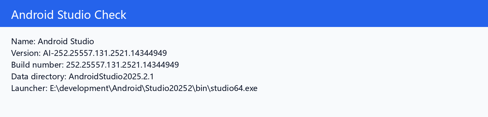
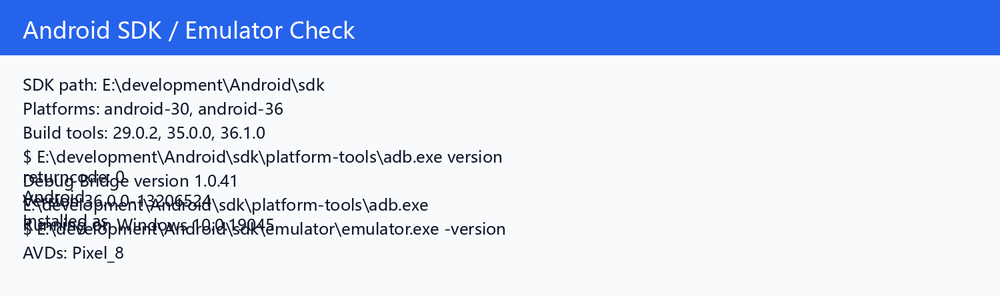
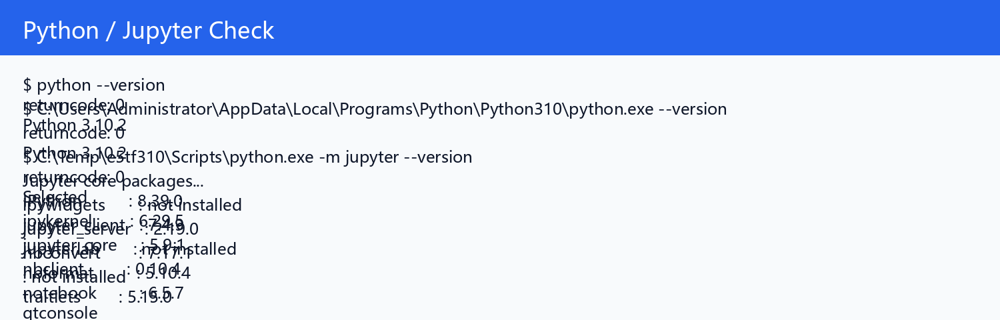
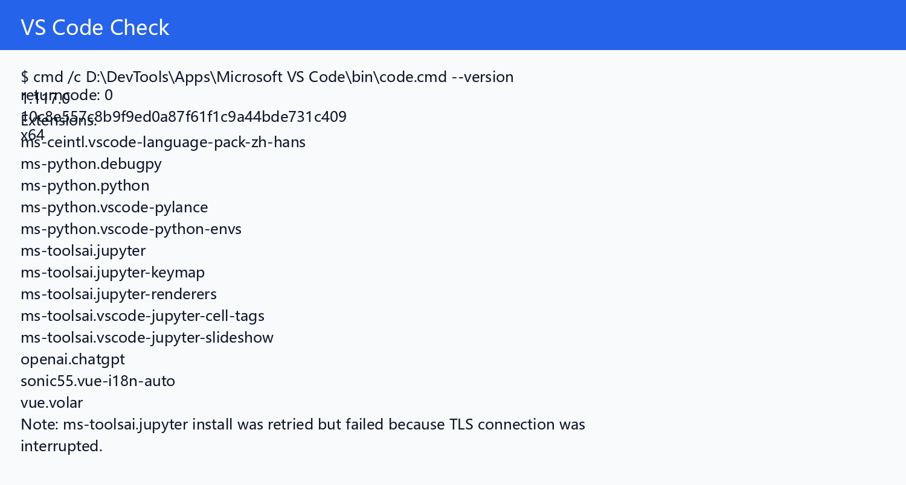
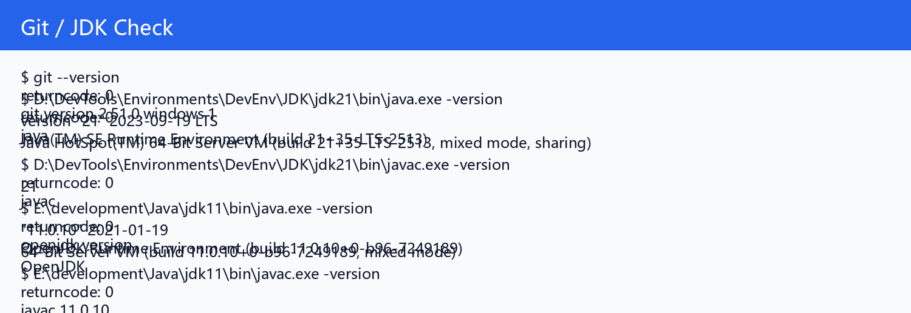
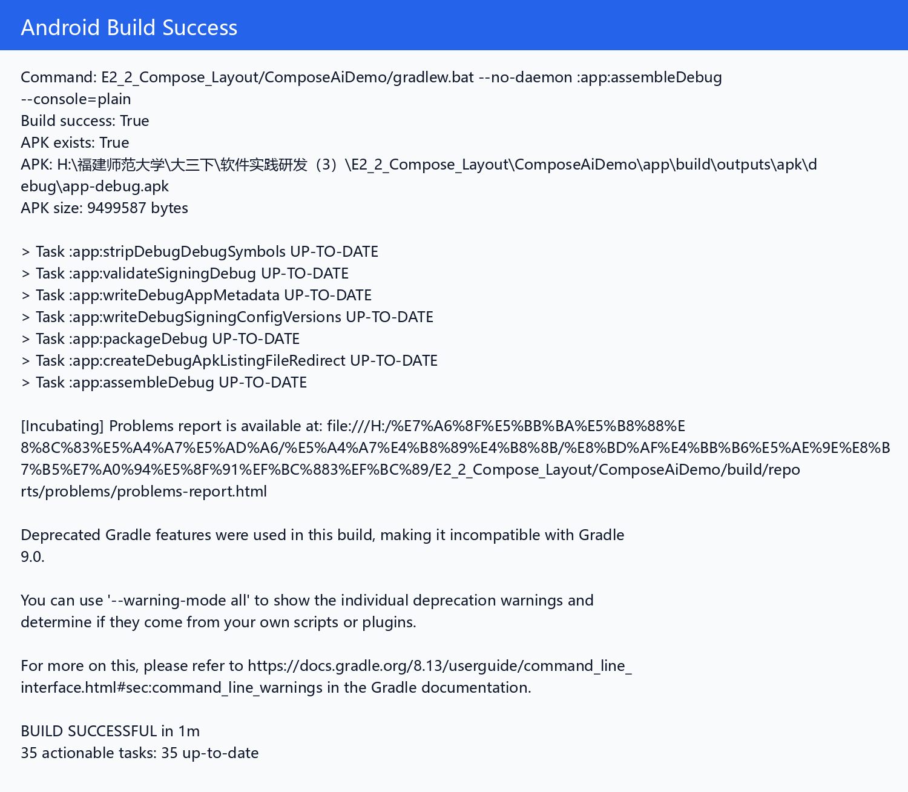
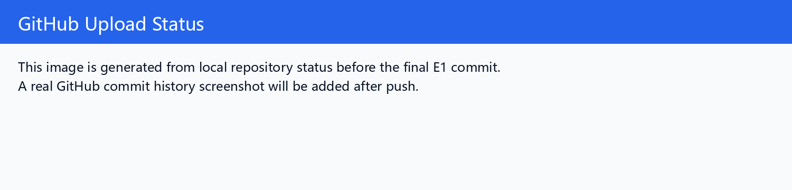

# 实验 1：开发环境安装与基础配置

## 一、实验目标

根据课程介绍和《实验1：安装相关软件》要求，完成 Android Studio、Jupyter Notebook / Python、Visual Studio Code、Git、JDK、Android SDK / Emulator 等课程开发环境的安装检查，并将安装和验证过程整理为 Markdown 文档上传到 GitHub。

## 二、实验要求对照

| 老师要求 | 本项目完成情况 |
|---|---|
| 安装 Android Studio 4.1 以上版本 | 已检测到 Android Studio `AI-252.25557.131.2521.14344949` |
| 安装 Jupyter Notebook 和 Python 环境 | 已检测 Python 3.10.2 和 Jupyter Notebook 6.5.7 |
| 安装 Visual Studio Code | 已检测 VS Code 1.117.0 |
| 安装 Python、Jupyter、Jupyter Keymap 等 VS Code 插件 | 已检测 Python、Pylance、debugpy、Jupyter Keymap；核心 Jupyter 扩展自动安装遇到网络 TLS 中断，已如实记录 |
| 新建 Android 应用并编译运行 | 使用后续 E2-2 Compose Android 工程执行 `assembleDebug`，构建成功并生成 APK |
| 将安装过程用 Markdown 描述并上传 GitHub | 已完成 README、环境记录、截图和 Git 提交 |

## 三、环境信息

| 项目 | 结果 |
|---|---|
| 操作系统 | `Windows-10-10.0.19045-SP0` |
| Android Studio | `AI-252.25557.131.2521.14344949` |
| Android Studio 路径 | `E:\development\Android\Studio20252\bin\studio64.exe` |
| Android SDK | `E:\development\Android\sdk` |
| SDK Platforms | `android-30, android-36` |
| Build Tools | `29.0.2, 35.0.0, 36.1.0` |
| AVD | `Pixel_8` |
| adb devices | `List of devices attached` |
| Python 3.10 | `Python 3.10.2` |
| Jupyter | `notebook 6.5.7` |
| VS Code | `1.117.0` |
| Git | `git version 2.51.0.windows.1` |
| JDK | JDK 21 + JDK 11 |

## 四、项目结构

```text
E1_Development_Environment_Setup/
├── README.md
├── docs/
├── images/
├── notebooks/
├── outputs/
└── scripts/
```

## 五、Android 环境验证

本机检测到 Android Studio、Android SDK、platform-tools、emulator 和 Pixel_8 AVD。为了验证 Android 编译链路可用，使用已经在后续实验中创建的 `E2_2_Compose_Layout/ComposeAiDemo` 工程执行：

```powershell
gradlew.bat --no-daemon :app:assembleDebug --console=plain
```

构建结果：`BUILD SUCCESSFUL`。APK 文件存在：`H:\福建师范大学\大三下\软件实践研发（3）\E2_2_Compose_Layout\ComposeAiDemo\app\build\outputs\apk\debug\app-debug.apk`。

## 六、Jupyter Notebook 验证

已创建并执行 `notebooks/E1_Jupyter_Environment_Check.ipynb`，其中包含 Markdown 单元和 Python 代码单元，验证 Notebook 可以保存代码、文本和输出结果。

## 七、VS Code 验证

VS Code 版本为 1.117.0，已检测到 Python、Pylance、debugpy 和 Jupyter Keymap 等扩展。自动安装核心 Jupyter 扩展时出现网络 TLS 中断，后续可在网络稳定时手动补装；本实验已经通过本地 Jupyter Notebook 验证课程所需 Notebook 能力。

## 八、输出文件

| 文件 | 说明 |
|---|---|
| `docs/environment_check.md` | 环境检查记录 |
| `docs/setup_notes.md` | 安装与使用笔记 |
| `outputs/environment_check.txt` | 命令行检查原始输出 |
| `outputs/android_build_output.txt` | Android Gradle 构建输出摘要 |
| `outputs/tool_versions.json` | 工具版本结构化记录 |
| `notebooks/E1_Jupyter_Environment_Check.ipynb` | Jupyter 环境验证 Notebook |
| `notebooks/E1_Jupyter_Environment_Check.html` | Notebook HTML 导出 |

## 九、截图记录
















## 十、遇到的问题与解决

| 问题 | 原因 | 解决 |
|---|---|---|
| 默认 Python 是 3.14 | 后续 TensorFlow 等工具不适合 Python 3.14 | 同时记录 Python 3.10，并使用 Python 3.10 虚拟环境运行 Jupyter |
| 未检测到 conda | 本机当前未配置 Anaconda / conda 到 PATH | 使用 Python venv + Jupyter 完成课程所需 Notebook 能力 |
| VS Code 核心 Jupyter 扩展安装失败 | 扩展市场 TLS 连接中断 | 已安装/检测 Python、Pylance、Jupyter Keymap，后续网络稳定后可手动补装 |
| `adb devices` 当前没有在线设备 | 没有启动模拟器或连接真机 | 已检测 Pixel_8 AVD，后续实验已使用模拟器运行 Android App |

## 十一、实验总结

本实验补齐了课程实验 1 的环境安装与基础配置记录。当前环境已经满足后续 Android + Kotlin + LiteRT 课程主线开发需要，并通过 Android Gradle 构建、Jupyter Notebook 执行、VS Code / Git / JDK / Android SDK 检查完成验证。
