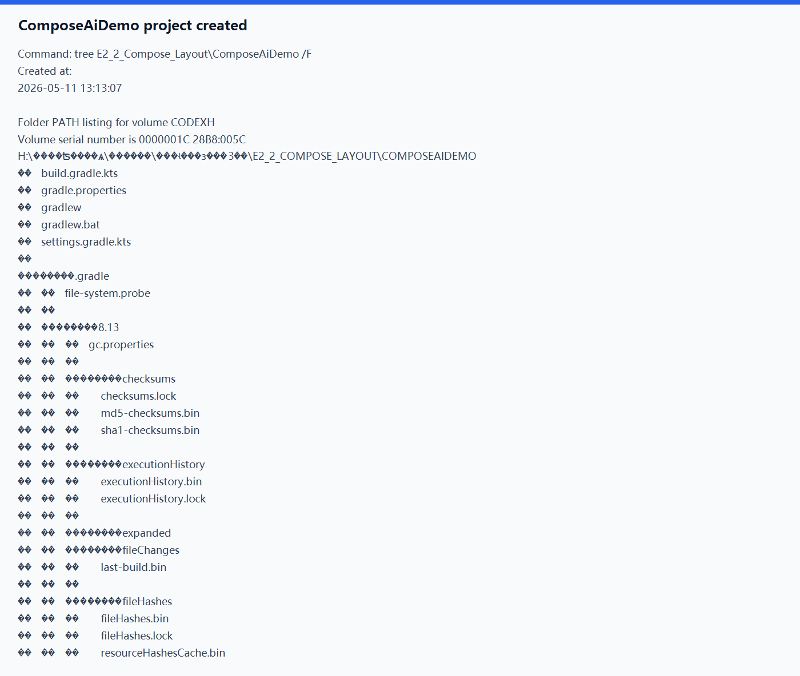
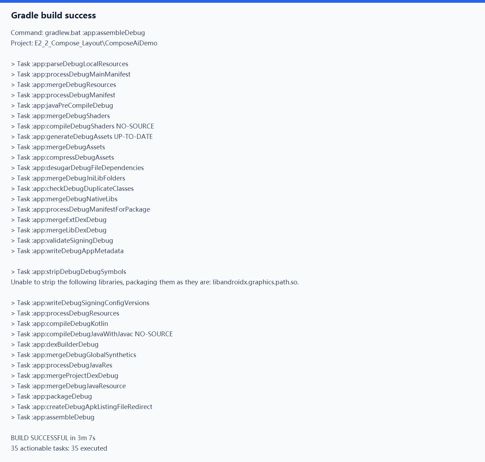
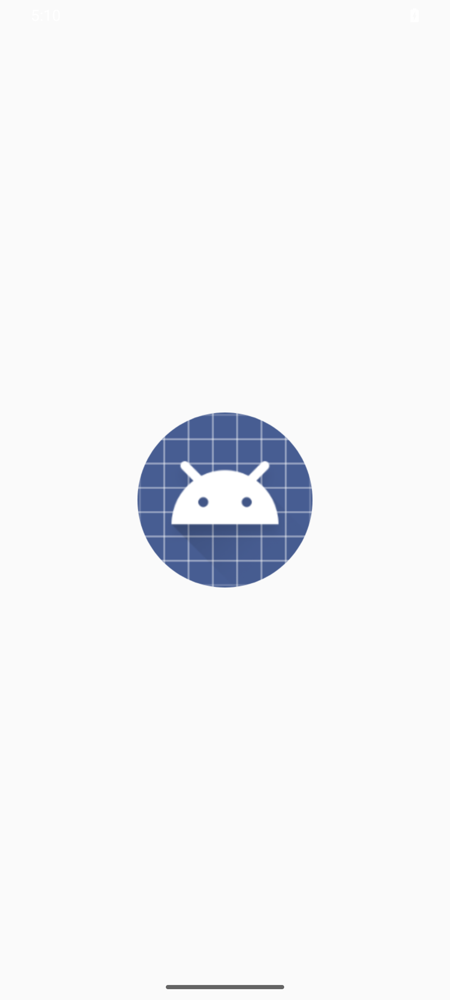
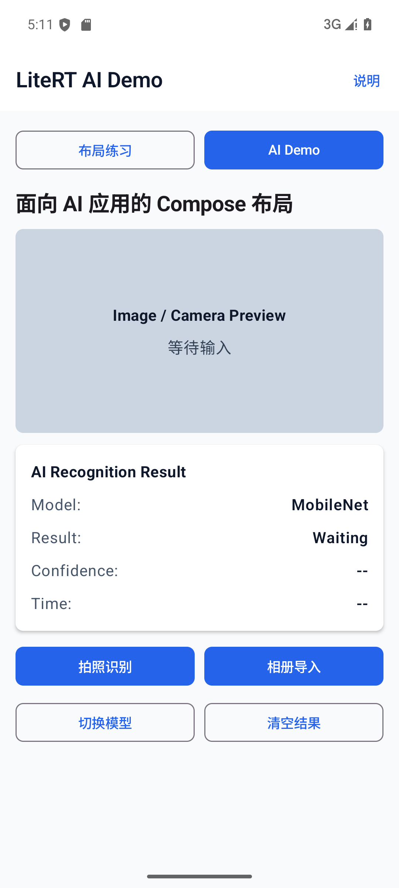
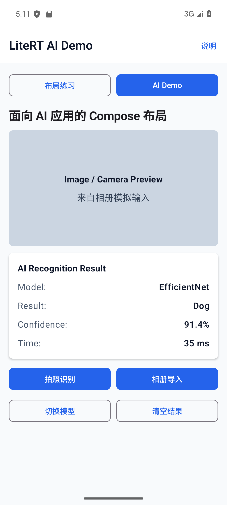
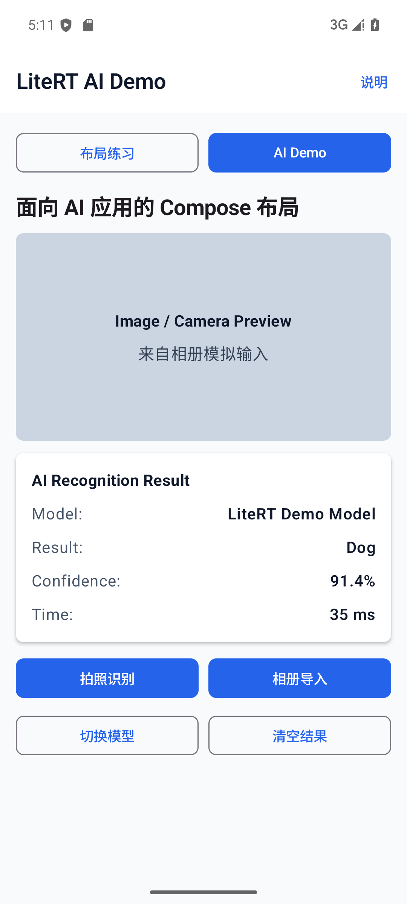
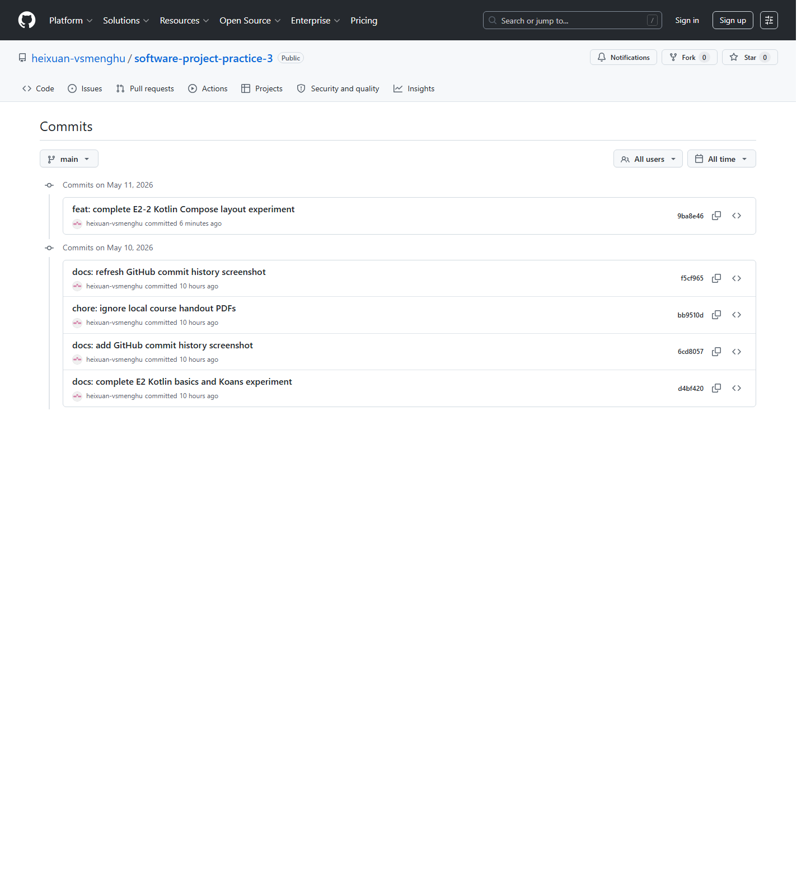

# 实验 2-2：构建 Kotlin 应用并使用 Compose 布局

## 一、实验目标

本次实验围绕 Android Kotlin 和 Jetpack Compose 展开，主要目标是：

1. 掌握使用 Kotlin 创建 Android 应用的基本流程。
2. 掌握 Jetpack Compose 中常用布局组件的使用方式。
3. 完成一个可构建、可运行、可交互的首个 Kotlin Compose APP。
4. 按课程要求完成面向 AI 应用的 Compose 布局原型。
5. 整理实验笔记、页面设计说明、运行截图和 GitHub 提交记录。

## 二、实验环境

| 项目 | 环境 |
|---|---|
| 操作系统 | Windows 10 |
| 开发工具 | Android Studio 2025.2、本地命令行 |
| JDK | Java 21 |
| Android SDK | API 36，build-tools 35.0.0 / 36.1.0 |
| Gradle | Gradle Wrapper 8.13 |
| Android Gradle Plugin | 8.9.3 |
| Kotlin | 2.0.21 |
| Compose | Compose BOM 2024.10.00 |
| 最小 SDK | API 21 |
| 包名 | `com.example.composeaidemo` |

## 三、实验内容与完成情况

| 老师要求 | 本项目完成情况 |
|---|---|
| 创建首个 Kotlin APP | 已创建 ComposeAiDemo Android 工程 |
| 实践 Compose 布局 | 已实现 LayoutPracticeScreen |
| 面向 AI 应用的 Compose 布局 | 已实现 AiDemoScreen |
| 上传 GitHub | 已提交并 push |
| 撰写详细 README | 已完成 |

本实验没有重复实验 2-1 的 Kotlin Koans 内容，也没有改动已有 `E2_Kotlin_Android_Basics/` 成果。

## 四、项目结构

```text
E2_2_Compose_Layout/
├── README.md
├── ComposeNotes.md
├── docs/
│   └── layout_design.md
├── ComposeAiDemo/
│   ├── app/
│   │   ├── build.gradle.kts
│   │   └── src/main/
│   │       ├── AndroidManifest.xml
│   │       ├── java/com/example/composeaidemo/MainActivity.kt
│   │       └── res/
│   ├── build.gradle.kts
│   ├── gradle.properties
│   ├── gradlew
│   ├── gradlew.bat
│   └── settings.gradle.kts
└── images/
    ├── project_created.png
    ├── gradle_build_success.png
    ├── layout_practice_screen.png
    ├── ai_layout_initial.png
    ├── ai_layout_after_photo.png
    ├── ai_layout_after_album.png
    ├── ai_layout_after_switch_model.png
    ├── ai_layout_after_clear.png
    └── github_commit_history.png
```

## 五、关键知识点

本次实验用到的 Kotlin 特性包括：

- `data class`：用于定义 `AiRecognitionState` 和 `PracticeItem`。
- `val / var`：不可变数据和可变状态分别使用。
- 默认参数：`AiRecognitionState` 提供默认模型、默认结果和默认输入来源。
- 字符串模板：推理耗时显示为 `"${it} ms"` 的形式。
- 空安全：`confidence ?: "--"` 和 `inferenceTimeMs?.let { ... } ?: "--"`。
- `when`：切换不同页面和循环切换模型。
- `List` 与 `forEach`：页面切换按钮、练习卡片、结果行都用列表组织。
- Lambda 点击事件：四个 AI 操作按钮都通过 Lambda 更新状态。

Compose 内容包括：

- `@Composable`
- `setContent`
- `MaterialTheme`
- `Scaffold`
- `TopAppBar`
- `Column`
- `Row`
- `Box`
- `Text`
- `Button`
- `Card`
- `Modifier`
- `remember`
- `mutableStateOf`
- `@Preview`

## 六、App 功能说明

App 有两个页面，可以通过顶部的“布局练习”和“AI Demo”按钮切换。

### 1. Compose 布局练习页面

该页面标题为“Compose 布局练习”，包含两张练习卡片：

- Hello World
- Hello Compose

每张卡片都有 `Show more` 按钮，点击后会展开说明。页面中间有一个 `Box` 预览占位区，底部还有“显示布局说明”按钮，用来展示或隐藏本页面使用的布局组件说明。

### 2. AI 应用布局页面

AI 页面顶部栏显示 `LiteRT AI Demo`。页面内容分为预览区、结果区和按钮区。

预览区当前只是 Compose `Box` 占位，用来模拟后续相机或图片画面。结果区使用 `Card` 展示模型、结果、置信度和推理耗时。按钮区包含四个按钮：

- 拍照识别：显示 `Cat`、`96.2%`、`28 ms`，输入来源变为“来自相机模拟输入”。
- 相册导入：显示 `Dog`、`91.4%`、`35 ms`，输入来源变为“来自相册模拟输入”。
- 切换模型：在 `MobileNet`、`EfficientNet`、`LiteRT Demo Model` 之间循环。
- 清空结果：恢复 `Waiting`、`--`、`--` 和“等待输入”。

当前识别结果是模拟数据，目的是完成 AI 应用的 Compose 布局和状态流转。实验没有接入真实 CameraX，也没有接入真实 LiteRT 模型推理。

## 七、核心代码说明

核心代码在：

```text
ComposeAiDemo/app/src/main/java/com/example/composeaidemo/MainActivity.kt
```

`MainActivity` 使用 `setContent` 加载 `ComposeAiDemoApp()`。

`ComposeAiDemoApp()` 使用 `MaterialTheme + Scaffold + TopAppBar` 搭建页面外壳，并通过 `selectedScreen` 控制两个页面切换。

`LayoutPracticeScreen()` 负责基础布局练习，集中使用 `Column`、`Row`、`Box`、`Text`、`Button`、`Card`。

`AiDemoScreen()` 负责 AI 应用页面，使用 `remember { mutableStateOf(AiRecognitionState()) }` 保存当前识别状态。点击按钮后更新状态，界面自动重组。

`ResultCard()` 展示 AI 识别结果，并用 Kotlin 空安全处理未识别时的默认显示：

```kotlin
val confidenceText = state.confidence ?: "--"
val timeText = state.inferenceTimeMs?.let { "$it ms" } ?: "--"
```

## 八、运行与构建方法

进入 Android 工程目录：

```bash
cd E2_2_Compose_Layout/ComposeAiDemo
```

Windows 下执行：

```bash
gradlew.bat :app:assembleDebug
```

本机已通过该命令成功构建 debug APK。

## 九、运行结果截图

















## 十、遇到的问题与解决方法

1. Gradle Wrapper 下载 8.12.1 时网络超时。

   解决方法：检查本机 Gradle 缓存后发现已经有完整的 Gradle 8.13 发行包，因此把 Wrapper 切换到 8.13。

2. Gradle 8.13 缓存中有损坏的 transform metadata。

   解决方法：停止 Gradle daemon，只清理可再生成的 Gradle transform/file hash 缓存后重新构建。

3. Android Gradle Plugin 在 Windows 中文路径下触发路径检查。

   解决方法：课程目录本身包含中文路径，按 AGP 提示在 `gradle.properties` 中加入 `android.overridePathCheck=true`。

4. 本机只有 JDK 21，没有单独安装 JDK 17。

   解决方法：不使用自动寻找 JDK 17 的 toolchain，改为用 JDK 21 运行 Gradle，同时设置 Kotlin/JVM 目标为 17。

5. AI 页面暂时没有真实相机和真实模型。

   解决方法：本次按实验要求完成 Compose 布局原型，使用模拟输入和模拟识别结果。后续接入 CameraX 和 LiteRT 时，可以复用当前页面结构。

## 十一、实验总结

通过本次实验，我完成了一个完整的 Kotlin Compose Android 工程，并把基础布局练习和 AI 应用原型放在同一个 App 中。布局练习页面让我熟悉了 Column、Row、Box、Card 等基础组件；AI 页面则把预览区、结果区和操作按钮组合成了更接近真实移动端 AI 应用的界面。

本次最大的收获是理解了状态驱动 UI：界面不是靠手动修改控件，而是由 `AiRecognitionState` 这样的状态对象统一驱动。按钮只负责更新状态，Compose 负责根据状态重组界面。这样的写法对后续接入 CameraX 和 LiteRT 更友好，因为真实推理结果也可以继续写入同一个状态对象。

## 十二、参考资料

1. 课程课件：`4_Android_Compose介绍.pdf`
2. 实验课件：`5_实验2_2_构建Kotlin应用并使用Compose布局.pdf`
3. Kotlin 官方网站：https://kotlinlang.org/
4. Jetpack Compose 官方教程：https://developer.android.com/jetpack/compose/tutorial
5. Jetpack Compose 基础知识：https://developer.android.com/jetpack/compose/documentation
6. Compose 中的基本布局：https://developer.android.com/develop/ui/compose/layouts/basics
7. 课件教程链接：https://blog.csdn.net/llfjfz/article/details/147382990
8. 课件教程链接：https://blog.csdn.net/llfjfz/article/details/147394477
