# 实验 2-3：构建 Android CameraX 应用

## 一、实验目标

本实验在课程仓库 `software-project-practice-3` 中新增 `E2_3_CameraX_App`，实现一个基于 Android CameraX 的 Kotlin 相机应用。

目标包括：

- 掌握 CameraX 的 Preview、ImageCapture、VideoCapture、ImageAnalysis。
- 掌握 Android `CAMERA`、`RECORD_AUDIO` 等硬件权限申请。
- 使用 XML 布局和 ViewBinding 构建页面，不使用 Compose 作为主界面。
- 使用 MediaStore 保存照片和视频。
- 理解 ImageAnalysis 如何作为后续 LiteRT / 移动 AI 实时推理入口。

## 二、实验环境

| 项目 | 实际环境 |
|---|---|
| 操作系统 | Windows |
| Android 工程 | `E2_3_CameraX_App/CameraXApp` |
| 开发语言 | Kotlin |
| UI 布局 | XML + ViewBinding |
| Android Gradle Plugin | 8.9.3 |
| Kotlin Plugin | 2.0.21 |
| compileSdk / targetSdk | 36 / 36 |
| minSdk | 21 |
| CameraX | 1.4.2 |
| 运行验证设备 | Android Emulator Pixel_8，API 35，Virtual Scene camera |

说明：AndroidX CameraX 官方当前稳定版已到 1.6.1，但该版本的 `camera-camera2-pipe` 要求 `minSdk 23`，与本实验要求的 API 21 冲突。因此本项目选择仍兼容 `minSdk 21` 的稳定版 CameraX 1.4.2。

## 三、实验内容与完成情况

| 老师要求 | 本项目完成情况 |
|---|---|
| 创建 CameraX APP | 已创建 CameraXApp Android 工程 |
| 学习 Android 布局 | 已使用 XML + ViewBinding 完成页面 |
| 获取 Android 硬件权限 | 已实现 CAMERA / RECORD_AUDIO 权限申请 |
| Preview 预览 | 已实现摄像头实时预览 |
| ImageCapture 拍照 | 已实现拍照并保存到 MediaStore |
| VideoCapture 录像 | 已实现开始 / 停止录像并保存视频 |
| ImageAnalysis 图像分析 | 已实现平均亮度分析并输出 Logcat |
| 上传 GitHub | 已提交并 push |
| 撰写 README | 已完成 |

## 四、项目结构

```text
E2_3_CameraX_App/
├── README.md
├── CameraXNotes.md
├── docs/
│   ├── code_flow.md
│   └── ai_extension_plan.md
├── CameraXApp/
│   ├── app/
│   │   ├── build.gradle.kts
│   │   └── src/main/
│   │       ├── AndroidManifest.xml
│   │       ├── java/com/example/cameraxapp/MainActivity.kt
│   │       └── res/layout/activity_main.xml
│   ├── build.gradle.kts
│   ├── settings.gradle.kts
│   └── gradle.properties
└── images/
    └── 实验截图
```

## 五、CameraX 核心知识点

CameraX 用 Use Case 表示相机能力。本项目绑定了四个 Use Case：

- `Preview`：把摄像头画面输出到 XML 中的 `PreviewView`。
- `ImageCapture`：点击 `TAKE PHOTO` 后拍照并保存图片。
- `VideoCapture<Recorder>`：点击 `START CAPTURE` 开始录像，再点击 `STOP CAPTURE` 停止并保存。
- `ImageAnalysis`：实时读取相机帧，计算平均亮度并显示到 UI 和 Logcat。

核心绑定流程：

```text
ProcessCameraProvider
  ↓
Preview / ImageCapture / VideoCapture / ImageAnalysis
  ↓
bindToLifecycle(this, cameraSelector, ...)
  ↓
Activity 生命周期自动管理相机资源
```

## 六、App 功能说明

启动 App 后会先申请相机和录音权限。授权后，页面上半部分显示摄像头预览，下半部分显示亮度分析、状态文本和四个按钮。

功能包括：

- `TAKE PHOTO`：保存照片到系统图片库。
- `START CAPTURE / STOP CAPTURE`：开始或停止录像，保存视频到系统视频库。
- `ANALYSIS ON / OFF`：开启或关闭亮度分析。
- `SWITCH CAMERA`：切换前后摄像头。

照片保存位置：

```text
Pictures/CameraX-Image
```

视频保存位置：

```text
Movies/CameraX-Video
```

## 七、核心代码说明

核心文件：

```text
CameraXApp/app/src/main/java/com/example/cameraxapp/MainActivity.kt
```

关键成员变量：

```kotlin
private lateinit var viewBinding: ActivityMainBinding

private var imageCapture: ImageCapture? = null
private var videoCapture: VideoCapture<Recorder>? = null
private var recording: Recording? = null

private lateinit var cameraExecutor: ExecutorService
private var cameraSelector = CameraSelector.DEFAULT_BACK_CAMERA
private var imageAnalysis: ImageAnalysis? = null
```

`startCamera()` 负责创建并绑定 Use Case。优先绑定 `Preview + ImageCapture + VideoCapture + ImageAnalysis`，如果设备不支持，则 fallback 到不含 `ImageAnalysis` 的组合。

`takePhoto()` 使用 `ImageCapture.OutputFileOptions` 和 `MediaStore.Images.Media.EXTERNAL_CONTENT_URI` 保存照片。

`captureVideo()` 使用 `Recorder`、`VideoCapture.withOutput(recorder)` 和 `MediaStoreOutputOptions` 保存视频，并处理 `VideoRecordEvent.Start` 与 `VideoRecordEvent.Finalize`。

`LuminosityAnalyzer` 从 `ImageProxy` 读取 Y 平面计算平均亮度，并在 `finally` 中调用 `image.close()`。

## 八、运行与构建方法

进入 Android 工程目录：

```powershell
cd E2_3_CameraX_App/CameraXApp
```

执行构建：

```powershell
.\gradlew.bat :app:assembleDebug
```

本地验证结果：

```text
BUILD SUCCESSFUL
```

如果在 Windows 中文路径下构建，AGP 会提示非 ASCII 路径风险。本项目在 `gradle.properties` 中加入：

```properties
android.overridePathCheck=true
```

这是为了在当前课程目录中文路径下完成构建。

## 九、运行结果截图

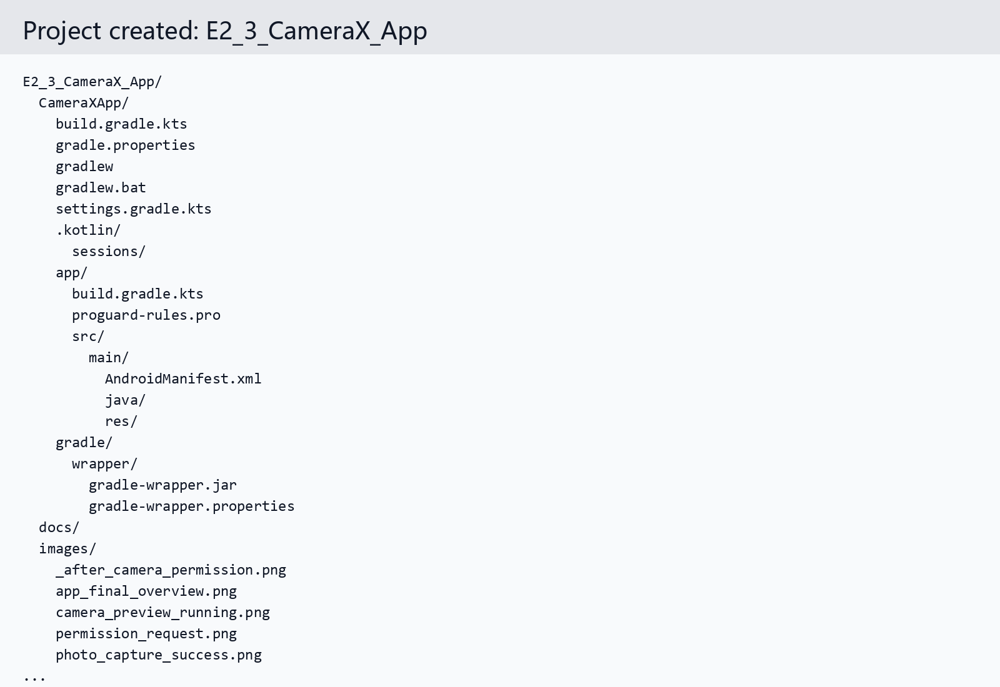

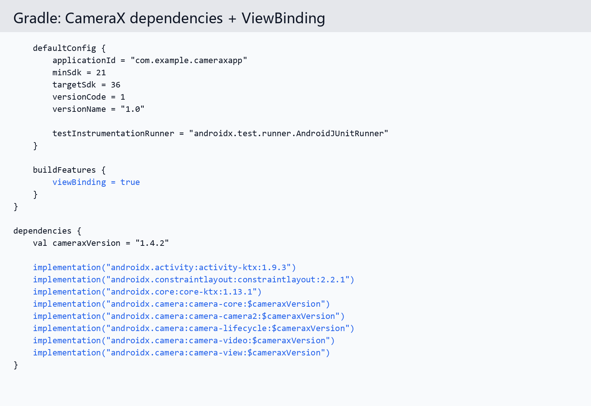

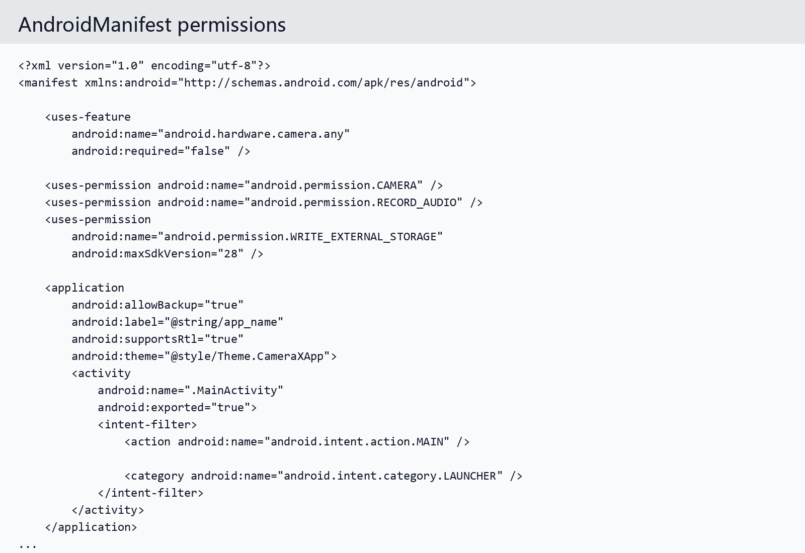

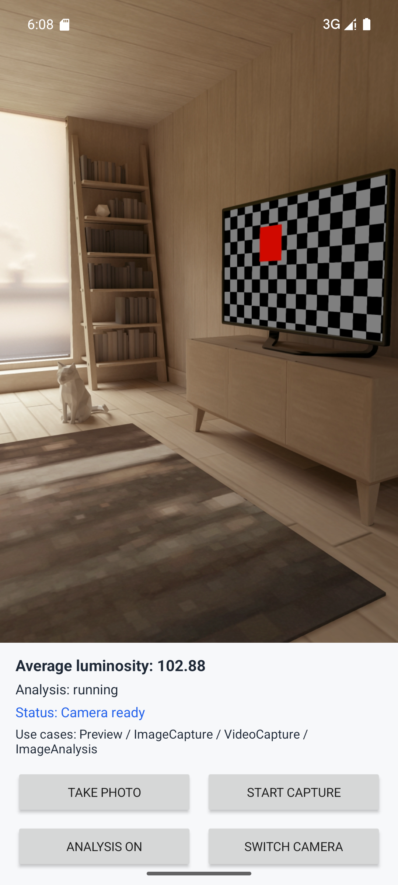

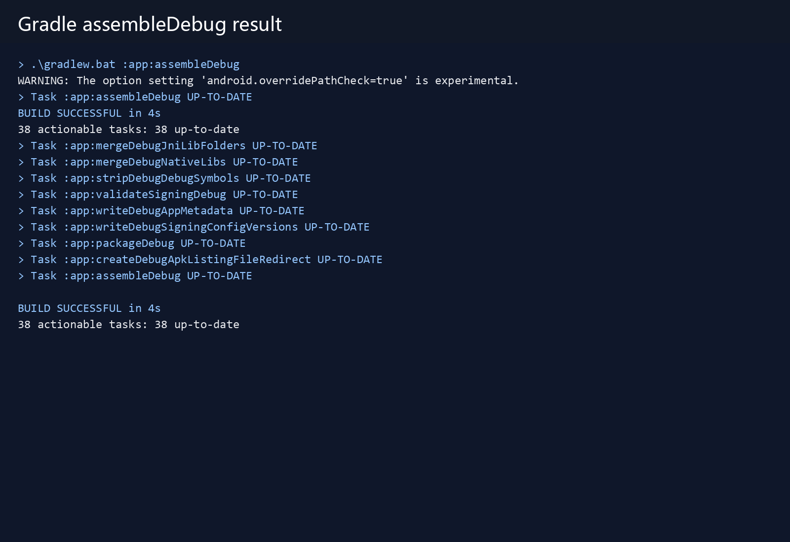

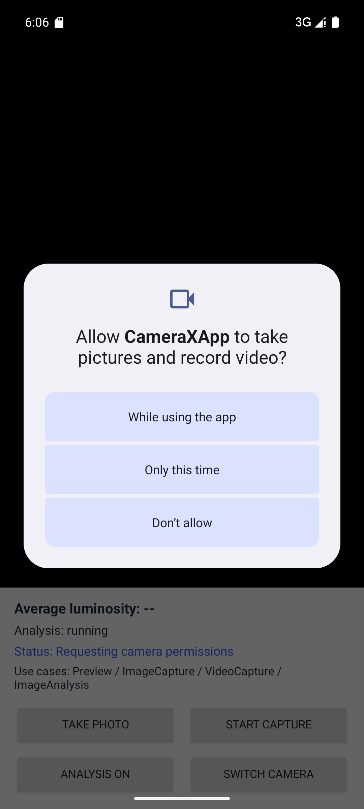


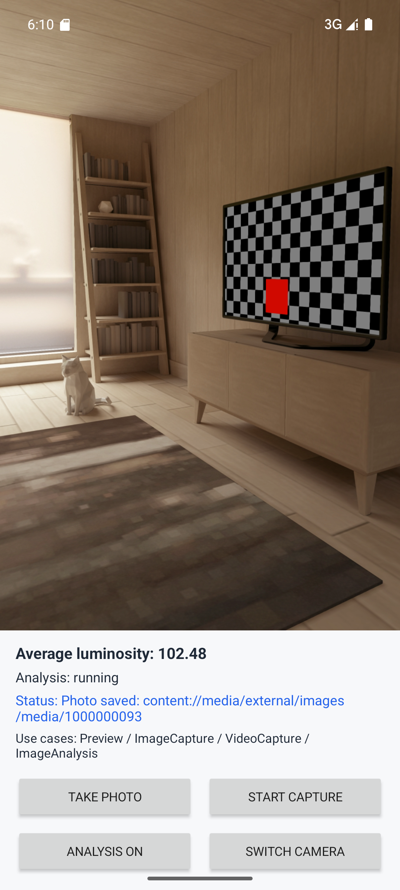

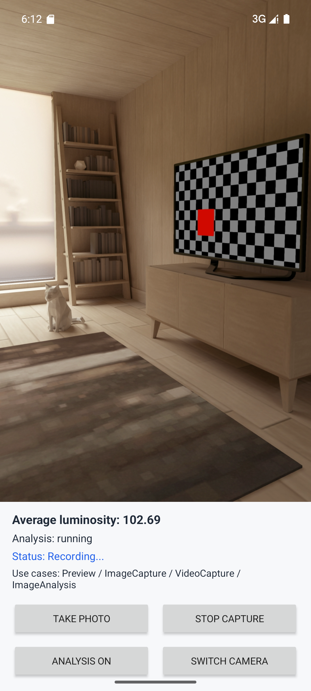

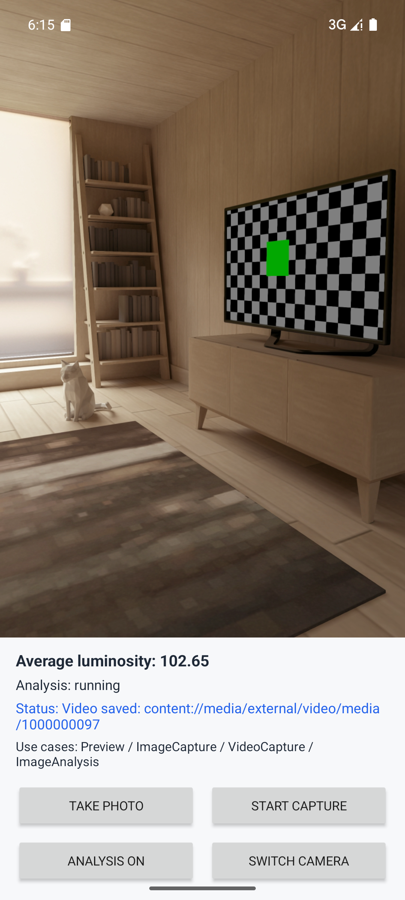

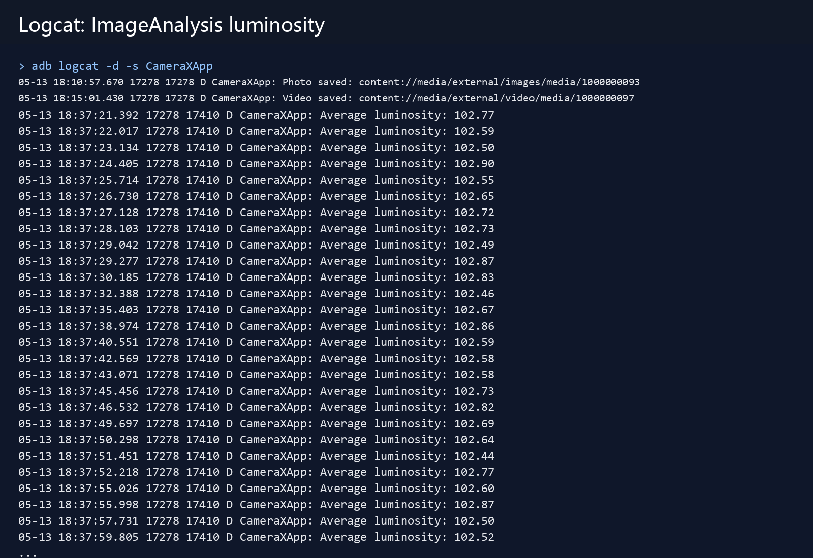

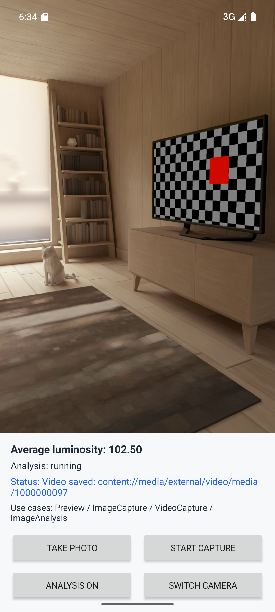

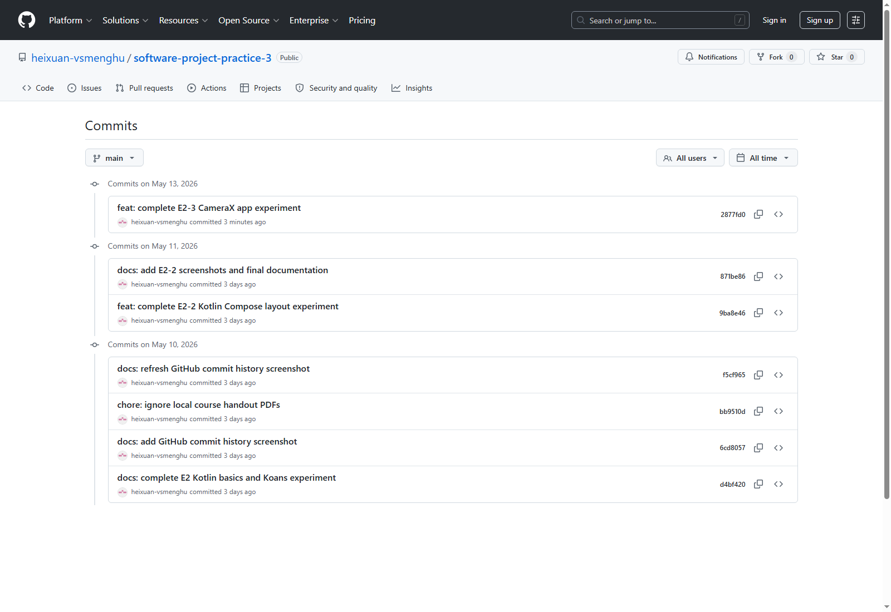

## 十、遇到的问题与解决方法

| 问题 | 解决方法 |
|---|---|
| Windows 中文路径导致 AGP 拒绝构建 | 在本工程 `gradle.properties` 中加入 `android.overridePathCheck=true` |
| CameraX 1.6.1 与 `minSdk 21` 不兼容 | 改用稳定版 CameraX 1.4.2，并在文档中说明原因 |
| 首次启动需要连续授权相机和麦克风 | 使用 `ActivityResultContracts.RequestMultiplePermissions()` 统一处理 |
| 模拟器预览开始时短暂黑屏 | 等待 Virtual Scene camera 初始化后预览正常 |
| 多 Use Case 组合可能被部分设备拒绝 | `startCamera()` 中加入 try/catch，并 fallback 到不含 ImageAnalysis 的组合 |

## 十一、与后续 LiteRT / 移动 AI 项目的关系

本实验中的 `ImageAnalysis` 是后续移动 AI 的入口。

当前流程：

```text
CameraX ImageAnalysis
  ↓
ImageProxy
  ↓
读取 Y 平面
  ↓
计算平均亮度
  ↓
更新 UI / Logcat
```

后续 LiteRT 流程可以替换为：

```text
CameraX ImageAnalysis
  ↓
ImageProxy
  ↓
转换 Bitmap / ByteBuffer
  ↓
resize + normalize
  ↓
LiteRT 模型推理
  ↓
显示分类 / 检测结果
```

因此，本实验并未虚假宣称已经完成 AI 推理，而是完成了实时相机帧输入通道，为后续模型接入做好准备。

## 十二、实验总结

本次实验完成了一个可构建、可运行、可截图验证的 CameraX 应用。相比只打开摄像头，本项目进一步实现了拍照、录像、权限申请、MediaStore 保存、亮度分析和 Use Case fallback。

通过本实验，我理解了 CameraX 的核心开发方式：用 Use Case 描述能力，用 `ProcessCameraProvider` 绑定生命周期，用 `PreviewView` 显示预览，用 `ImageAnalysis` 获取实时帧。后续接入 LiteRT 时，可以直接在当前 `LuminosityAnalyzer` 的位置扩展模型推理逻辑。

## 十三、参考资料

- [Android Developers: CameraX overview](https://developer.android.com/media/camera/camerax)
- [AndroidX Camera release notes](https://developer.android.com/jetpack/androidx/releases/camera)
- 课程课件：`6_CameraX基础.pdf`
- 课程课件：`7_实验2_3_构建CameraX应用.pdf`
