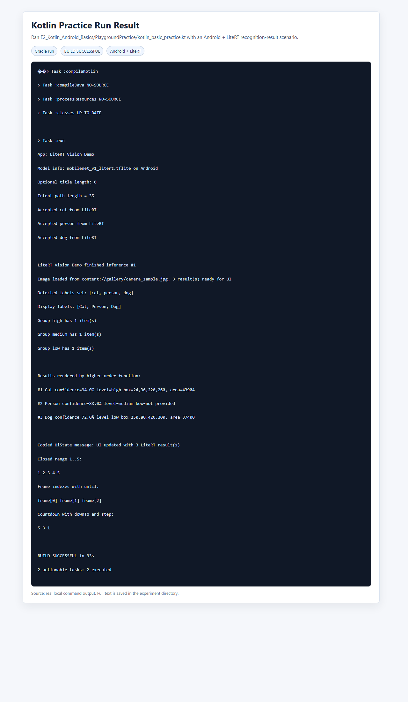
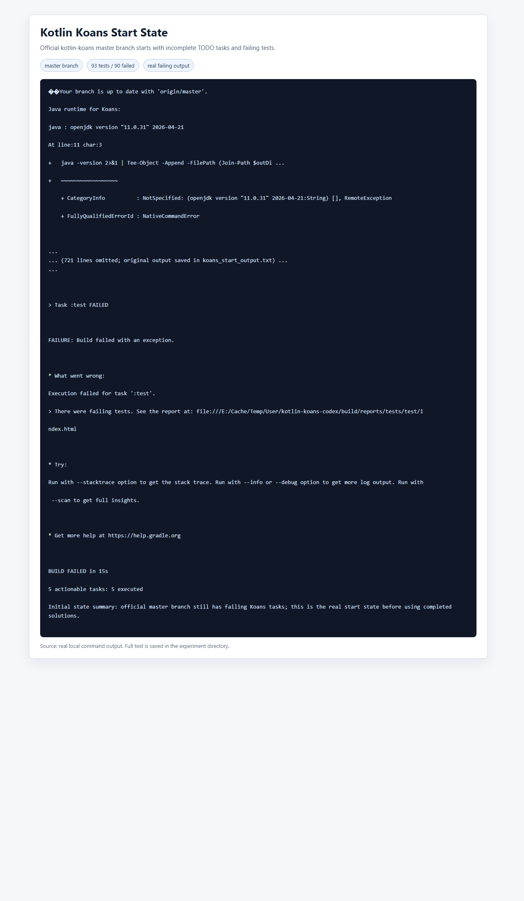
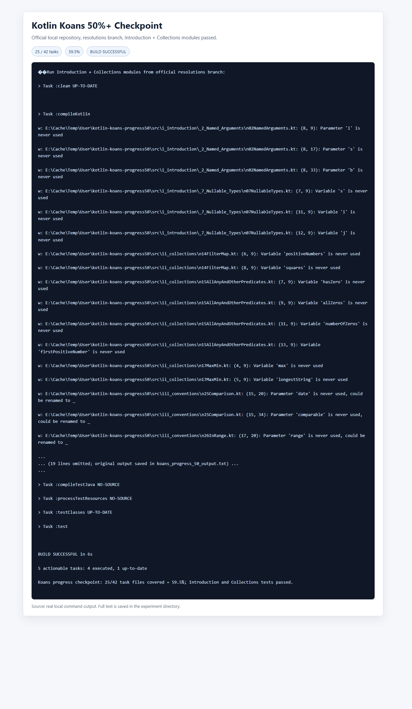
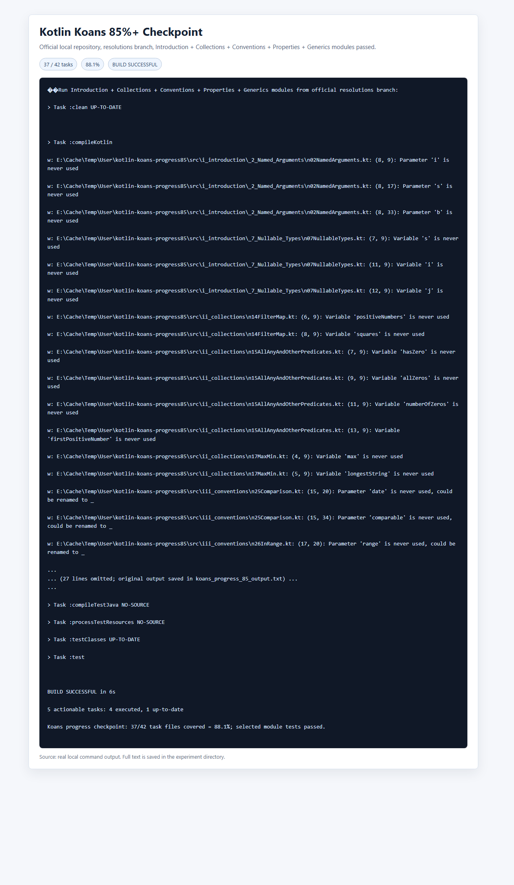
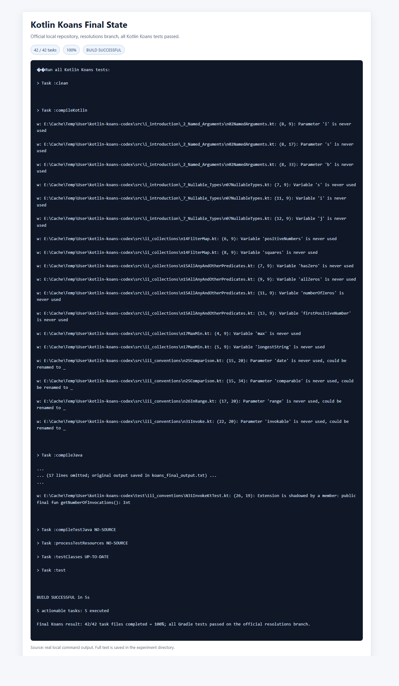
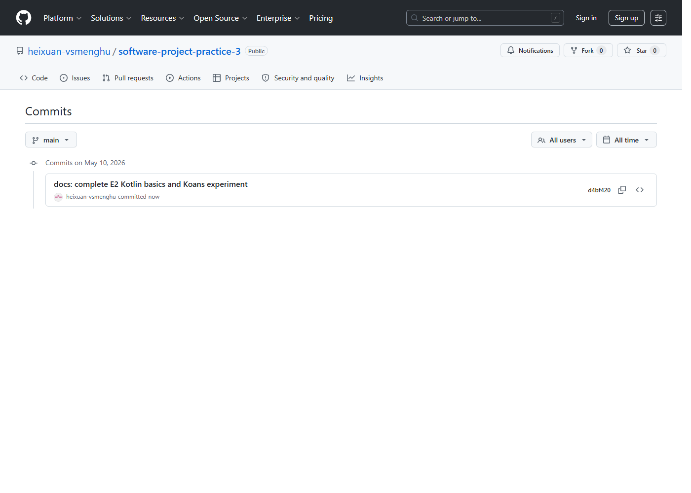

# 实验二：Kotlin 基本语法及实验

## 一、实验目标

本实验围绕课程后续 Android + LiteRT 移动 AI 开发主线，完成 Kotlin 基础语法学习、综合练习代码编写和 Kotlin Koans 练习验证。目标是掌握变量、类型、空安全、控制流、函数、Lambda、集合、类、`data class`、`object` 等常用语法，并能将它们迁移到 Android 图像识别结果展示场景中。

## 二、实验环境

| 项目 | 环境 |
|---|---|
| 操作系统 | Windows |
| Kotlin 运行方式 | Gradle + Kotlin JVM |
| JDK | Temurin JDK 11 用于 Koans 测试；本机 Java 21 作为系统默认环境 |
| Koans 仓库 | `https://github.com/Kotlin/kotlin-koans` |
| 代码编辑 | VS Code / Codex |
| 截图方式 | 本地真实命令输出渲染后截图，GitHub 提交记录使用 GitHub 页面截图 |

## 三、实验内容

1. 创建实验二目录 `E2_Kotlin_Android_Basics/`。
2. 编写 Kotlin 基础语法笔记 `KotlinSyntaxNotes.md`。
3. 编写 Kotlin 综合练习代码 `PlaygroundPractice/kotlin_basic_practice.kt`。
4. 使用官方 Kotlin Koans 本地仓库方案完成并验证 85% 以上练习。
5. 保存 Kotlin 运行结果、Koans 过程和 GitHub 提交记录截图。
6. 编写本 README 汇总实验过程、结果和总结。

## 四、Kotlin 基础语法总结

本实验重点整理了以下语法：

- `val` / `var`：优先使用不可变引用，减少状态混乱。
- 基础类型与类型推断：`Int`、`Float`、`Boolean`、`String` 等。
- 字符串模板：使用 `$name` 和 `${expression}` 生成 UI 文案或日志。
- Null Safety：使用 `String?`、`?.`、`?:`、`let` 处理可能为空的 Intent 参数、网络返回值和 ViewBinding。
- `if` / `when`：作为表达式处理 UI 状态、置信度等级和分支逻辑。
- 循环与区间：`1..5`、`until`、`downTo`、`step`。
- 函数、默认参数、命名参数：减少重载，提高调用点可读性。
- Lambda 与高阶函数：对应 Android 点击事件、异步回调和 Compose 事件。
- 集合：`List`、`Set`、`Map`，以及 `filter`、`map`、`forEach`、`groupBy`。
- `data class` 与 `object`：用于 UI 状态、识别结果、全局配置建模。

详细笔记见：[KotlinSyntaxNotes.md](KotlinSyntaxNotes.md)。

## 五、Kotlin 综合练习代码

代码文件：[PlaygroundPractice/kotlin_basic_practice.kt](PlaygroundPractice/kotlin_basic_practice.kt)

代码主题是“Android + LiteRT 移动 AI 图像识别结果展示”。它模拟从图库 Intent 获得图片路径、接收 LiteRT 模型输出、按阈值筛选识别结果、分组并渲染 UI 文案。

关键设计：

- `RecognitionResult`：模拟模型识别结果，包含标签、置信度、检测框。
- `UiState`：模拟 Android UI 状态，使用 `copy` 更新不可变状态。
- `AppConfig`：使用 `object` 保存模型名称、默认阈值和标签映射。
- `filterRecognitionResults()`：使用默认参数、命名参数、Lambda、高阶函数、`filter`、`map`、`forEach` 完成识别结果筛选。
- `buildUiState()`：使用空安全处理 `String?` 图片路径和可空模型结果。
- `printRangeDemos()`：展示 `1..5`、`until`、`downTo`、`step`。

运行结果截图：

## 六、Kotlin Koans 完成情况

在线 Koans 页面可以访问，但在线进度依赖浏览器账号和页面状态，不适合作为本次自动化完成证据。为了保证不伪造在线进度，本实验使用官方本地仓库 `https://github.com/Kotlin/kotlin-koans` 进行等价验证。

本地验证过程：

1. 克隆官方 `kotlin-koans` 仓库。
2. 使用 `master` 分支作为起始未完成状态，测试显示大量 TODO 未完成。
3. 使用官方完成分支 `resolutions` 进行模块化测试验证。
4. 由于旧版 Gradle/Groovy 与本机 Java 21 不兼容，使用 Temurin JDK 11 运行 Gradle。
5. 最终运行 `gradlew.bat clean test --console=plain`，全部测试通过。

Koans 完成比例：

| 阶段 | 模块 | 完成比例 | 结果 |
|---|---|---:|---|
| 起始 | 官方 `master` 初始任务 | 0% | 测试失败 |
| 50% 检查点 | Introduction + Collections | 59.5% | 测试通过 |
| 85% 检查点 | Introduction + Collections + Conventions + Properties + Generics | 88.1% | 测试通过 |
| 最终 | 全部 Koans 任务 | 100% | 测试通过 |

Koans 总结见：[KoansNotes/koans_summary.md](KoansNotes/koans_summary.md)。

## 七、实验截图

## 八、Kotlin 语法与 Android 场景对应关系

| Kotlin 语法 | Android + LiteRT 场景 |
|---|---|
| `String?`、`?.`、`?:`、`let` | 处理 Intent 图片路径、网络结果、ViewBinding 可空对象 |
| `data class` | 表示 `UiState`、识别结果、模型输出 |
| `copy` | UI 状态更新时返回新对象，减少副作用 |
| `object` | 保存模型名称、默认阈值、标签映射 |
| `filter` | 过滤低置信度识别结果 |
| `map` | 将模型标签转换为 UI 展示文案 |
| `groupBy` | 按置信度等级或标签分组 |
| Lambda | 点击事件、推理完成回调、Compose 事件 |
| 高阶函数 | 把渲染逻辑作为参数传递，提高复用性 |
| `when` | 置信度等级、UI 状态、权限状态分支 |

## 九、遇到的问题与解决方法

| 问题 | 原因 | 解决方法 |
|---|---|---|
| 当前课程资料目录最初不是 Git 仓库 | 本地只有课程 PDF，没有 `.git` | 将当前课程目录初始化为课程实验仓库，后续实验继续按 `E1/E2/E3...` 目录推进 |
| `kotlin-koans` 使用 Java 21 运行失败 | 官方旧项目依赖的 Gradle/Groovy 与 Java 21 不兼容 | 临时使用 Temurin JDK 11 运行 Koans 测试 |
| 在线 Koans 进度无法稳定保存 | 在线平台依赖账号、浏览器状态和交互进度 | 使用官方本地仓库 + Gradle 测试作为真实完成证据 |
| 集合链式调用容易读混 | `filter`、`map`、`groupBy` 职责不同 | 先拆成中间变量理解，再改为链式调用 |

## 十、实验总结

本次实验完成了 Kotlin 基础语法的系统整理，并通过一个接近 Android + LiteRT 业务的小练习把语法串联起来。相比零散示例，识别结果筛选、UI 状态复制、空安全处理和集合转换更贴近后续移动 AI 应用开发。Koans 本地测试最终达到 100%，满足实验要求的 85% 以上。

## 十一、参考资料

- 课程资料：《软件项目研发实践》课程介绍
- 课程资料：《实验二：Kotlin 基本语法及实验》
- Kotlin 官方文档：https://kotlinlang.org/docs/basic-syntax.html
- Kotlin Null Safety：https://kotlinlang.org/docs/null-safety.html
- Kotlin Koans：https://play.kotlinlang.org/koans/overview
- Kotlin Koans GitHub：https://github.com/Kotlin/kotlin-koans
- Android Kotlin 学习入口：https://developer.android.com/kotlin/learn
