# 实验 5-1：TensorFlow 模型生成

## 一、实验目标

本实验使用 TensorFlow / Keras 训练花卉图像分类模型，将模型转换为 LiteRT / TensorFlow Lite `.tflite` 格式，并接入已经完成的实验 4 Android 智能图像分类 App 进行验证。

## 二、实验环境

| 项目 | 实际情况 |
|---|---|
| Python | 3.10.2 |
| TensorFlow | 2.10.1 |
| NumPy | 1.23.5 |
| 训练环境 | Windows 本地 CPU |
| GPU | 未检测到 GPU |
| Notebook | 本地 Jupyter / nbconvert |
| Android 构建 | Gradle Wrapper + JDK 11 |
| Android 验证 | Pixel_8 模拟器 |

## 三、完成情况

| 老师要求 | 本项目完成情况 |
|---|---|
| 了解机器学习基础 | 已在 `TensorFlowLiteRTNotes.md` 和 Notebook 中总结 |
| 了解 TensorFlow 和 LiteRT | 已说明 TensorFlow 训练与 LiteRT / TFLite 端侧部署关系 |
| 完成基于 TensorFlow 的花卉模型生成 | 已使用 TensorFlow / Keras 训练花卉分类模型 |
| 不使用已废弃 Model Maker 作为主方案 | 已改用 TensorFlow / Keras + TensorFlow Lite Converter |
| 使用实验四应用验证生成模型 | 已接入 E4 `start` 模块，构建成功并在模拟器运行推理 |
| 共享 Jupyter Notebook | 已生成 `.ipynb` 和 `.html` |
| 上传 GitHub | 已提交并 push 到课程仓库 main 分支 |
| 撰写 Markdown 文档 | 已完成 README、Notes、model_info 和 Android 集成文档 |

## 四、项目结构

```text
E5_1_TensorFlow_Model_Generation/
├── README.md
├── TensorFlowLiteRTNotes.md
├── requirements.txt
├── environment.yml
├── notebooks/
├── data/
├── models/
├── src/
├── outputs/
├── android_integration/
└── images/
```

## 五、为什么不使用 TensorFlow Lite Model Maker

TensorFlow Lite Model Maker 曾经可以简化自定义数据集训练 TFLite 模型的流程，但该方案维护状态和依赖兼容性较差。本实验不使用 Model Maker，而是使用 TensorFlow / Keras 训练模型，再通过 TensorFlow Lite Converter 转换为 `.tflite` / LiteRT 模型。

## 六、数据集说明

| 项目 | 内容 |
|---|---|
| 数据集 | TensorFlow 官方 `flower_photos` |
| 来源 | `https://storage.googleapis.com/download.tensorflow.org/example_images/flower_photos.tgz` |
| 图片数量 | 3670 |
| 类别 | `daisy`, `dandelion`, `roses`, `sunflowers`, `tulips` |
| 是否提交完整数据集 | 不提交，Notebook 和脚本会自动下载 |

## 七、模型训练流程

1. 下载 `flower_photos` 数据集。
2. 按 80% / 20% 构建训练集和验证集。
3. 使用 ImageNet 预训练 MobileNetV2 作为冻结特征提取器。
4. 训练 Dropout + Dense softmax 分类头。
5. 组合完整 Keras 模型并评估验证集。
6. 保存 Keras 模型、SavedModel、TFLite 模型和量化 TFLite 模型。
7. 使用 Python 端 TensorFlow Lite Interpreter 验证 `.tflite` 推理。

## 八、训练结果

| 项目 | 结果 |
|---|---|
| 输入尺寸 | 224 x 224 x 3 |
| 模型结构 | MobileNetV2 alpha=0.35 + GlobalAveragePooling + Dropout + Dense softmax |
| 训练轮数 | 5 |
| 验证准确率 | 0.8815 |
| 验证损失 | 0.3588 |
| 普通 TFLite | `models/flower_classifier.tflite` |
| 量化 TFLite | `models/flower_classifier_quant.tflite` |
| Android 模型副本 | `models/FlowerModel_E5.tflite` |
| 标签 | `models/labels.txt` |

## 九、运行方法

本机实际使用短路径虚拟环境避免 Windows 长路径问题：

```powershell
py -3.10 -m venv C:\Temp\e5tf310
C:\Temp\e5tf310\Scripts\python.exe -m pip install -r E5_1_TensorFlow_Model_Generation\requirements.txt
```

训练和生成模型：

```powershell
C:\Temp\e5tf310\Scripts\python.exe E5_1_TensorFlow_Model_Generation\src\train_flower_model.py
```

Python 端 TFLite 推理验证：

```powershell
cd E5_1_TensorFlow_Model_Generation
C:\Temp\e5tf310\Scripts\python.exe src\test_tflite_inference.py
```

执行 Notebook 并导出 HTML：

```powershell
cd E5_1_TensorFlow_Model_Generation
C:\Temp\e5tf310\Scripts\python.exe -m nbconvert --execute --inplace notebooks\E5_1_TensorFlow_Flower_Model_Generation.ipynb
C:\Temp\e5tf310\Scripts\python.exe -m nbconvert --to html notebooks\E5_1_TensorFlow_Flower_Model_Generation.ipynb
```

## 十、Android 接入实验 4

E4 工程路径：

```text
E4_Intelligent_Image_Classification_App/TFLClassify/start/
```

原始模型已备份：

```text
android_integration/backup/FlowerModel_E4_original.tflite
```

E5 模型已替换到：

```text
E4_Intelligent_Image_Classification_App/TFLClassify/start/src/main/ml/FlowerModel.tflite
```

标签文件已复制到：

```text
E4_Intelligent_Image_Classification_App/TFLClassify/start/src/main/assets/labels.txt
```

由于 E5 自训练模型没有原始示例模型的 metadata，Android 端已从 ML Model Binding 调整为 TensorFlow Lite `Interpreter` 手动映射输出。

构建命令：

```powershell
cd E4_Intelligent_Image_Classification_App/TFLClassify
$env:JAVA_HOME='E:\development\Java\jdk11'
$env:Path="$env:JAVA_HOME\bin;$env:Path"
$env:ANDROID_SDK_HOME='C:\Temp\codex-android-home'
$env:ANDROID_USER_HOME='C:\Temp\codex-android-home\.android'
.\gradlew.bat --no-daemon :start:assembleDebug
```

构建结果：成功，APK 为：

```text
E4_Intelligent_Image_Classification_App/TFLClassify/start/build/outputs/apk/debug/start-debug.apk
```

## 十一、验证结果

| 验证项 | 结果 |
|---|---|
| Python 端 TFLite 推理 | 成功 |
| E5 模型复制到 E4 | 成功 |
| E4 替换模型后构建 | 成功 |
| E4 模拟器启动 | 成功 |
| E4 CameraX 预览 | 成功 |
| E4 Logcat 模型推理 | 成功 |
| 真机花卉实拍 | 当前未连接真机，后续可补充 |

Logcat 已显示 E5 模型输出的五类标签 Top-3，例如：

```text
roses / 40.9%, daisy / 40.8%, tulips / 13.1%
daisy / 49.0%, roses / 30.0%, tulips / 14.8%
```

## 十二、主要文件

| 文件 | 说明 |
|---|---|
| `notebooks/E5_1_TensorFlow_Flower_Model_Generation.ipynb` | 已执行 Notebook |
| `notebooks/E5_1_TensorFlow_Flower_Model_Generation.html` | Notebook HTML |
| `models/flower_classifier.keras` | Keras 模型 |
| `models/saved_model/` | TensorFlow SavedModel |
| `models/flower_classifier.tflite` | 普通 TFLite 模型 |
| `models/flower_classifier_quant.tflite` | 动态量化 TFLite 模型 |
| `models/FlowerModel_E5.tflite` | Android 接入模型副本 |
| `outputs/evaluation_metrics.json` | 验证指标 |
| `outputs/tflite_inference_results.csv` | Python TFLite 推理结果 |
| `android_integration/INTEGRATION_GUIDE.md` | Android 接入说明 |

## 十三、运行结果截图

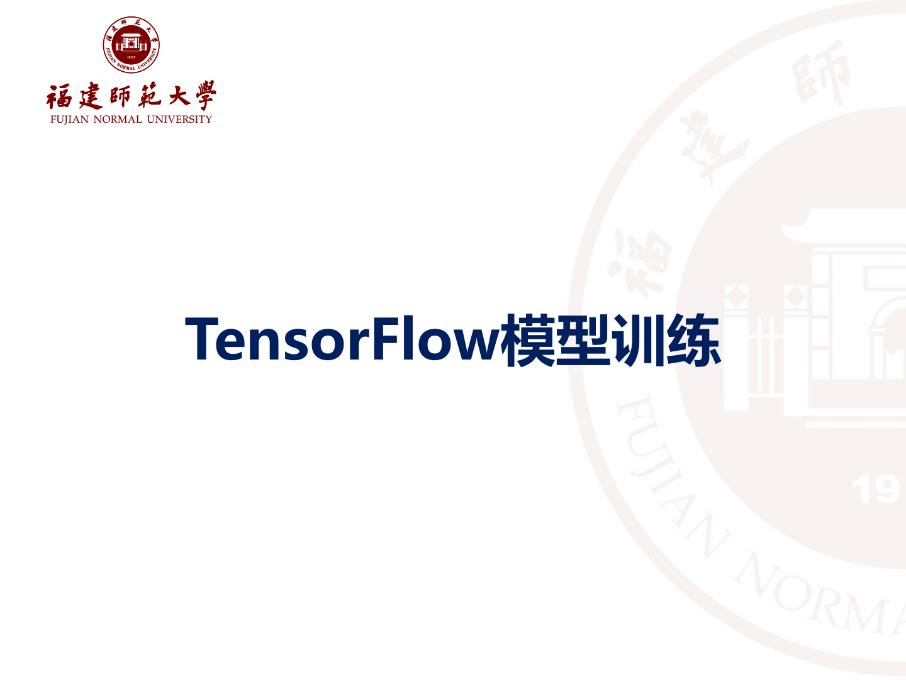


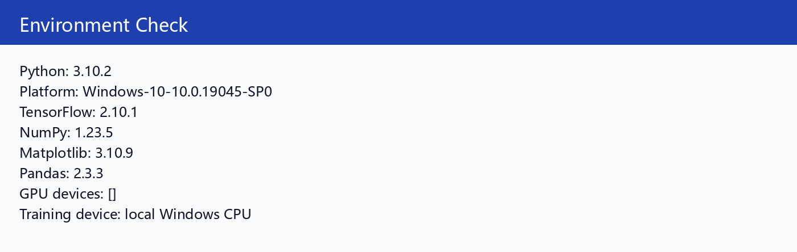

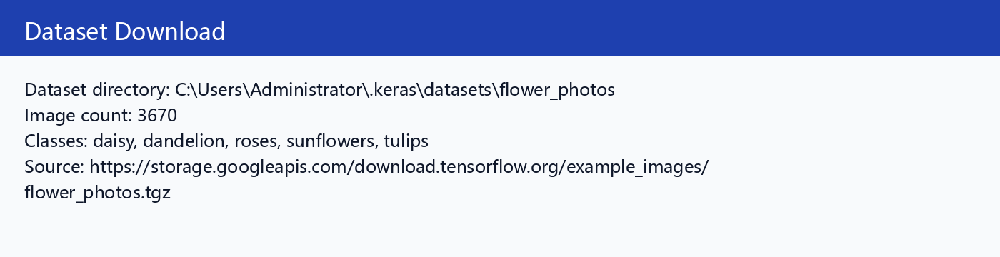

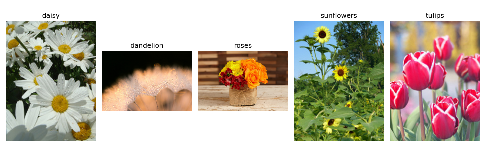

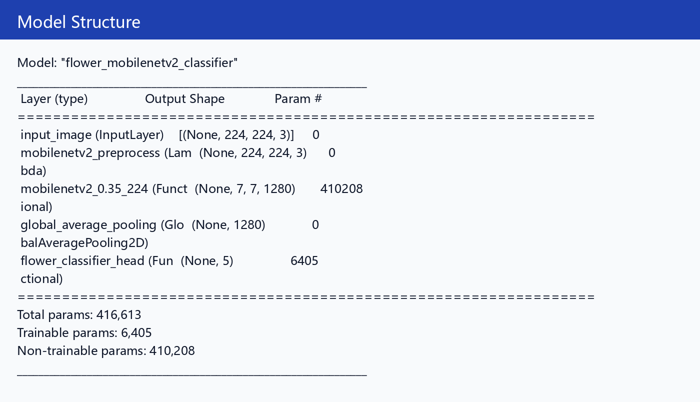

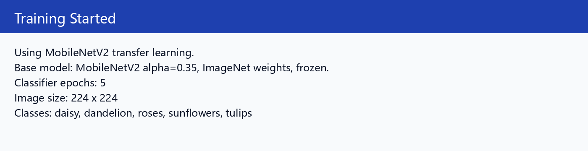

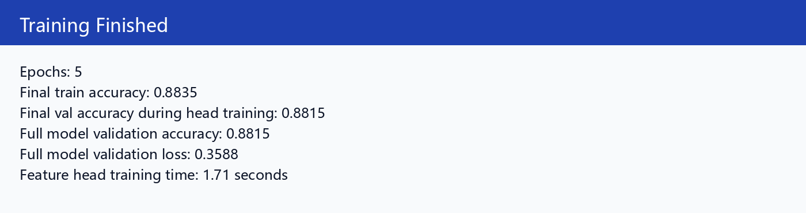

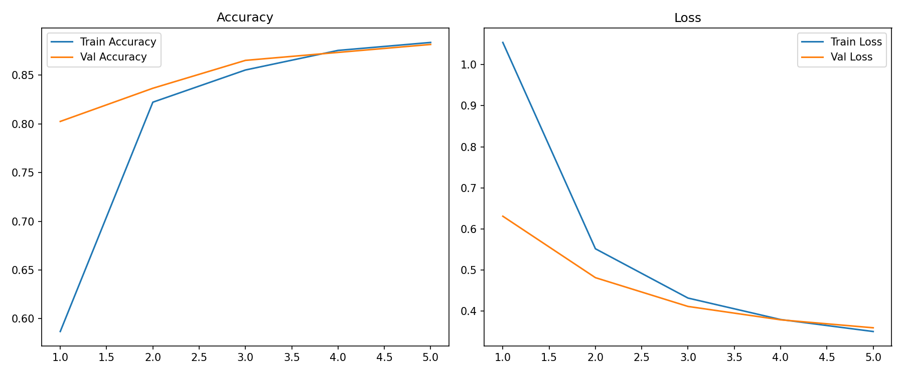

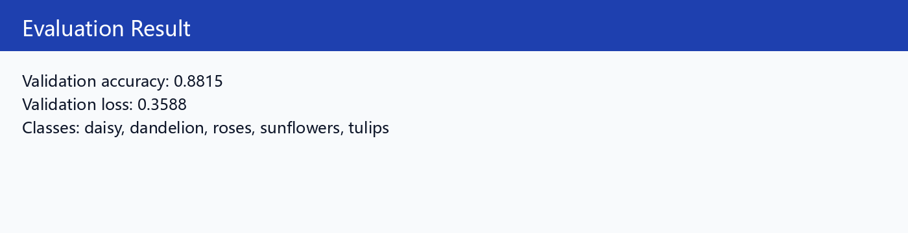

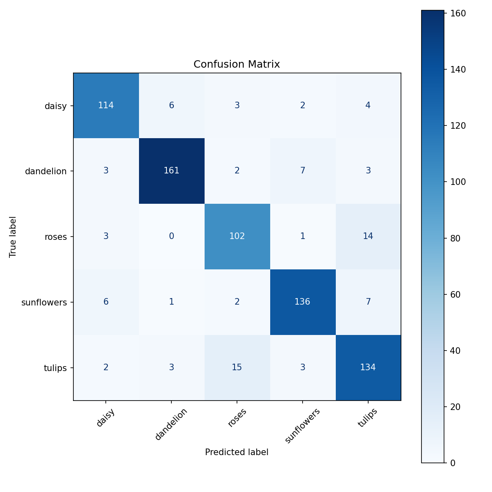

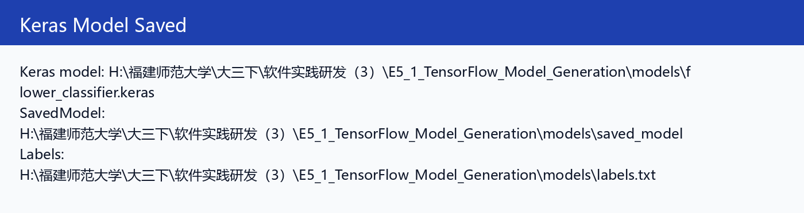

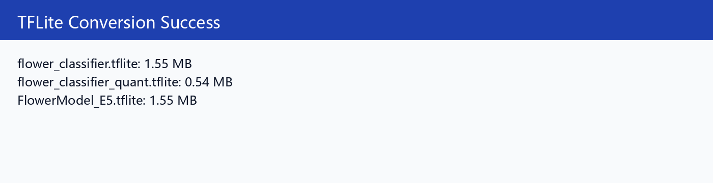

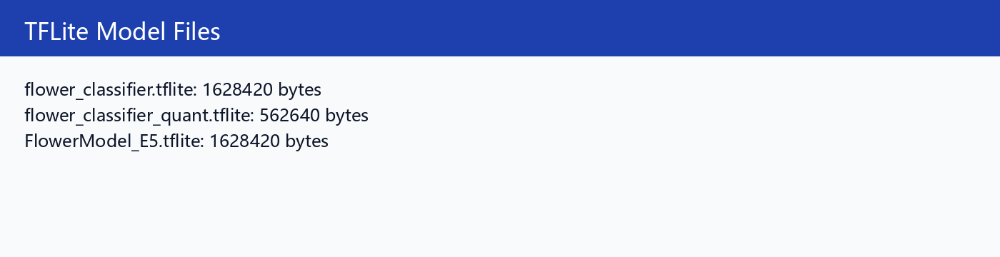

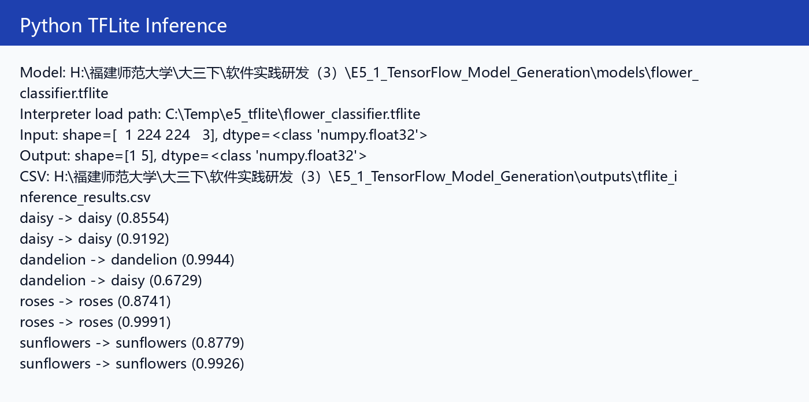

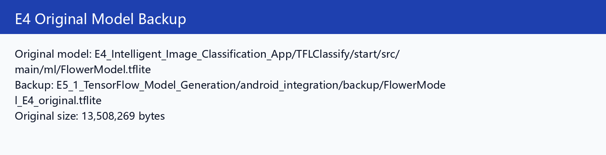

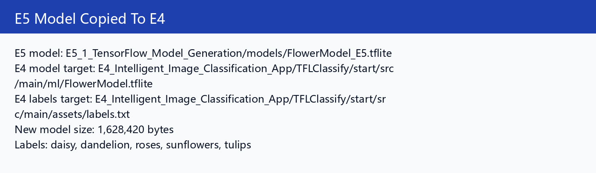

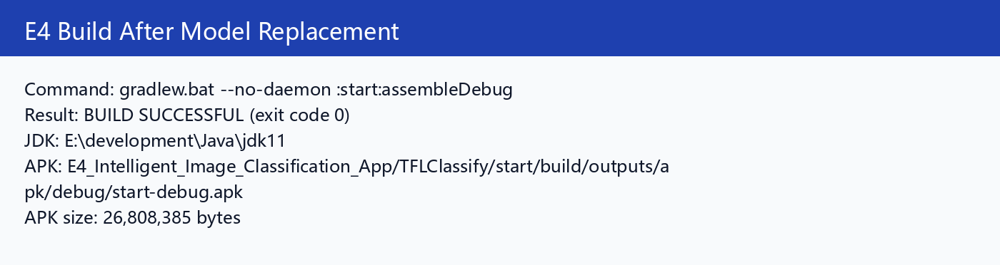


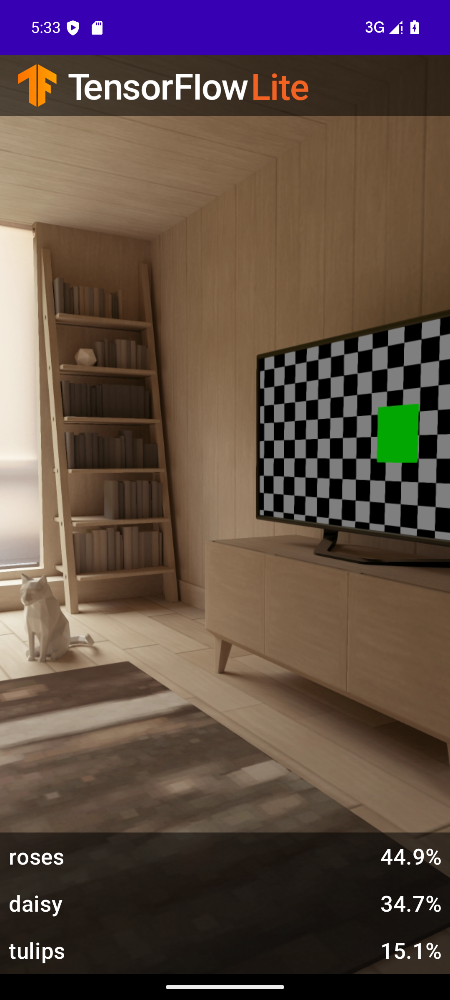

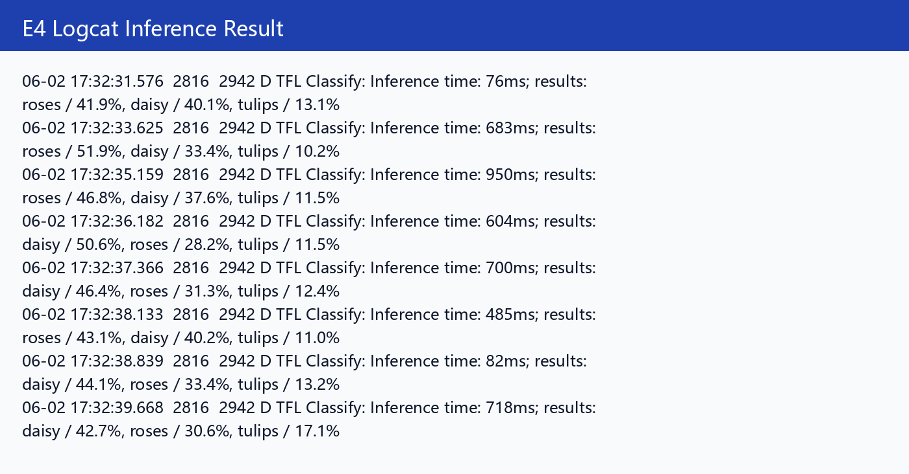

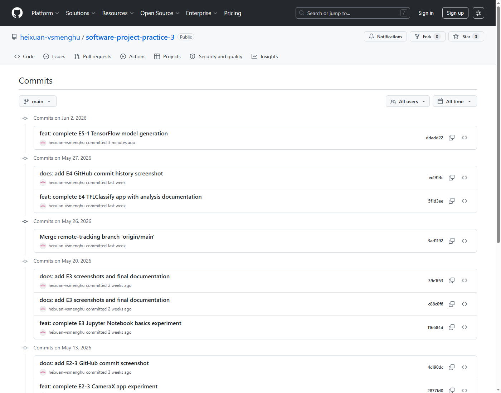

## 十四、遇到的问题与解决

| 问题 | 原因 | 解决 |
|---|---|---|
| 默认 Python 3.14 不能安装 TensorFlow | TensorFlow Windows 原生环境不支持该版本 | 使用 Python 3.10 |
| 项目内 `.venv` 安装 Jupyter 触发长路径错误 | Windows 长路径限制 | 改用 `C:\Temp\e5tf310` |
| TFLite Interpreter 打不开中文路径模型 | TensorFlow 2.10 Windows TFLite 路径兼容问题 | 推理时临时复制模型到 `C:\Temp\e5_tflite` |
| E4 初次构建出现 Duplicate resources | `src/main/ml` 模型会自动合并到 assets，又手动放了一份同名模型 | 删除 `assets/FlowerModel.tflite`，保留 `ml/FlowerModel.tflite` |
| E5 模型缺少 E4 原模型 metadata | 无法继续依赖 `probabilityAsCategoryList` | Android 端改用 `Interpreter + labels.txt` |

## 十五、实验总结

本实验完成了从 TensorFlow / Keras 训练、SavedModel 导出、TFLite 转换、Python 推理验证，到 Android E4 App 模型替换和模拟器运行验证的完整闭环。最终模型验证准确率为 `0.8815`，E4 App 已能加载 E5 自训练模型并输出 E5 标签结果。

## 十六、参考资料

- TensorFlow 官方 `flower_photos` 示例数据集
- TensorFlow / Keras 文档
- TensorFlow Lite / LiteRT 文档
- 实验 4 已完成的 TFLClassify Android 工程
