# 实验 5-2：TensorFlow 石头剪刀布手势模型生成

## 一、实验目标

本实验使用 TensorFlow / Keras 完成 rock、paper、scissors 三分类手势识别模型训练，掌握数据集下载、图片预处理、Sequential CNN 建模、compile 编译、fit 训练、测试集评估、性能图形绘制、Keras 模型保存、TFLite / LiteRT 转换和 Python 端推理验证流程。

## 二、实验环境

| 项目 | 实际情况 |
|---|---|
| Python | 3.10.2 |
| TensorFlow | 2.10.1 |
| NumPy | 1.23.5 |
| Notebook | 本地 Jupyter / nbconvert |
| 训练环境 | Windows 本地 CPU |
| GPU | 未检测到 GPU |
| 训练设备 | local Windows CPU |

## 三、实验内容与完成情况

| 老师要求 | 本项目完成情况 |
|---|---|
| 掌握 TensorFlow 模型训练和生成流程 | 已通过 Notebook 完成完整训练流程 |
| 下载石头剪刀布图片数据集 | 已下载 `rps.zip` 和 `rps-test-set.zip` |
| 验证下载的数据集 | 已统计类别数量并显示样例图片 |
| 使用 Keras 进行模型训练 | 已使用 TensorFlow / Keras 完成模型训练 |
| 图片预处理 | 已完成 resize、rescale 和数据增强 |
| 定义模型架构 Sequential | 已构建 Sequential CNN 模型 |
| 编译模型 compile | 已设置 optimizer、loss、accuracy |
| 使用训练数据 fit | 已训练模型并保留训练输出 |
| 生成模型验证 | 已使用测试集评估模型 |
| 绘制图形验证性能 | 已绘制 accuracy / loss 曲线、混淆矩阵、预测样例图 |
| 上传 GitHub | 已提交并 push |
| 撰写 README | 已完成 |

## 四、项目结构

```text
E5_2_RPS_Gesture_Model_Generation/
├── README.md
├── RPSModelNotes.md
├── requirements.txt
├── environment.yml
├── notebooks/
├── data/
├── models/
├── src/
├── outputs/
└── images/
```

## 五、核心知识点

本实验覆盖 TensorFlow、Keras、Sequential、CNN、Conv2D、MaxPooling2D、Flatten、Dense、Dropout、softmax、图片预处理、训练集/验证集/测试集、compile、loss、accuracy、fit、混淆矩阵、TFLite / LiteRT 等内容，详细说明见 `RPSModelNotes.md`。

## 六、数据集说明

| 项目 | 内容 |
|---|---|
| 训练集 | `https://storage.googleapis.com/learning-datasets/rps.zip` |
| 测试集 | `https://storage.googleapis.com/learning-datasets/rps-test-set.zip` |
| 类别 | `paper, rock, scissors` |
| 每类训练图片数量 | paper: 840, rock: 840, scissors: 840 |
| 每类测试图片数量 | paper: 124, rock: 124, scissors: 124 |
| 标签顺序 | `paper, rock, scissors` |
| 是否提交完整数据集 | 不提交，Notebook 和脚本会自动下载 |

## 七、图片预处理

图片统一调整为 150 x 150 x 3，并通过 `rescale=1/255` 转换到 0 到 1 的浮点范围。训练集使用旋转、平移、缩放和水平翻转做数据增强，验证集和测试集用于观察模型泛化效果。

## 八、Sequential 模型结构

模型使用 Keras `Sequential` 构建，主要结构为多组 `Conv2D + MaxPooling2D`，之后经过 `Flatten`、`Dropout(0.5)`、`Dense(256)` 和 `Dense(3, softmax)` 输出三类概率。

## 九、模型编译 compile

编译参数为 `optimizer="adam"`、`loss="categorical_crossentropy"`、`metrics=["accuracy"]`。该设置适合当前 one-hot 标签形式的三分类任务。

## 十、模型训练 fit

本地实际训练轮数为 5。为了保证课堂实验效率，本次优先完成完整闭环；训练日志已保留在 Notebook 输出中。

## 十一、模型评估与性能图形验证

| 指标 | 结果 |
|---|---:|
| 测试集准确率 | 1.0000 |
| 测试集损失 | 0.0191 |
| 最终训练准确率 | 0.9673 |
| 最终验证准确率 | 0.9425 |

已生成 `outputs/training_accuracy_loss.png`、`outputs/confusion_matrix.png`、`outputs/sample_predictions_keras.png` 和 `outputs/sample_predictions_tflite.png`。

## 十二、TFLite / LiteRT 模型转换

已从 SavedModel 转换出普通 TFLite 和动态量化 TFLite：

| 文件 | 大小 |
|---|---:|
| `models/rps_classifier.keras` | 21.20 MB |
| `models/rps_classifier.tflite` | 7.05 MB |
| `models/rps_classifier_quant.tflite` | 1.78 MB |

## 十三、Python 端 TFLite 推理验证

已运行 `src/test_tflite_inference.py`，推理结果保存到 `outputs/tflite_inference_results.csv`。Windows 下 TensorFlow 2.10 的 TFLite Interpreter 对中文路径兼容性较差，脚本会把模型临时复制到 `C:/Temp/e5_2_tflite/` 再加载。

## 十四、运行与复现方法

```powershell
C:\Temp\e5tf310\Scripts\python.exe -m pip install -r E5_2_RPS_Gesture_Model_Generation\requirements.txt
cd E5_2_RPS_Gesture_Model_Generation
C:\Temp\e5tf310\Scripts\python.exe src\train_rps_model.py --epochs 5
C:\Temp\e5tf310\Scripts\python.exe src\test_tflite_inference.py
C:\Temp\e5tf310\Scripts\python.exe -m nbconvert --execute --inplace notebooks\E5_2_RPS_Gesture_Model_Generation.ipynb
C:\Temp\e5tf310\Scripts\python.exe -m nbconvert --to html notebooks\E5_2_RPS_Gesture_Model_Generation.ipynb
```

## 十五、运行结果截图

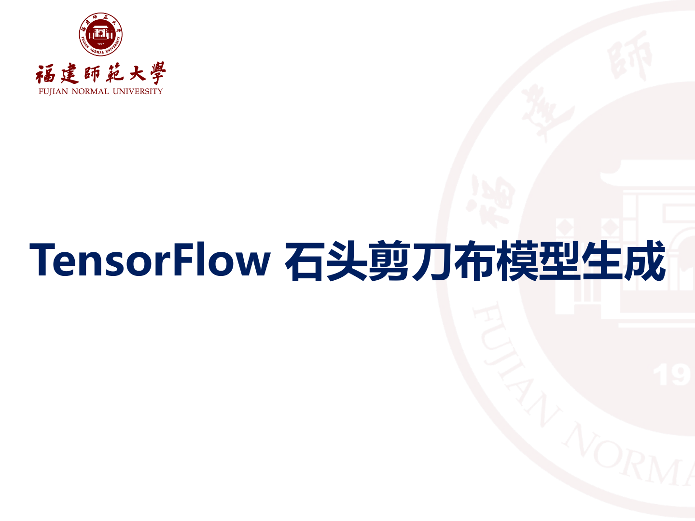

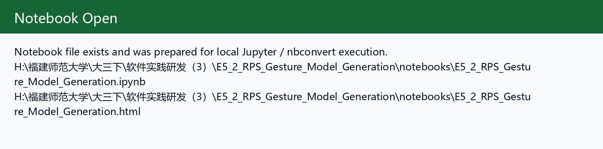

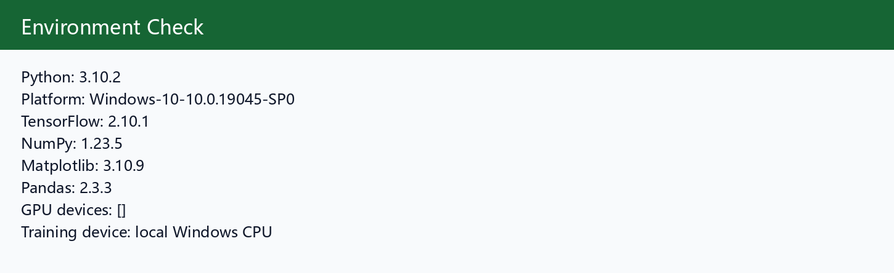

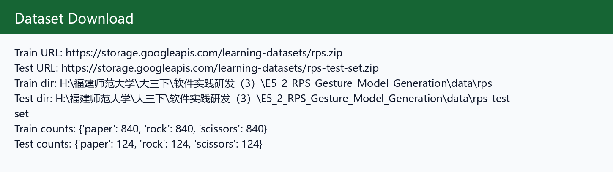

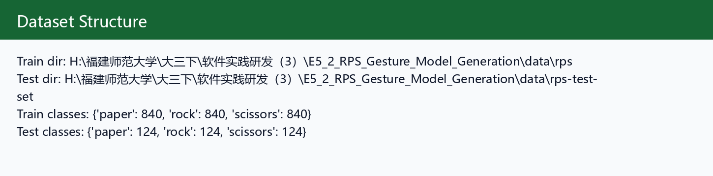

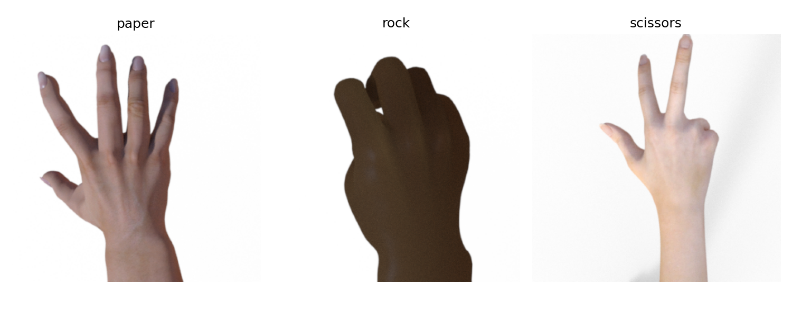

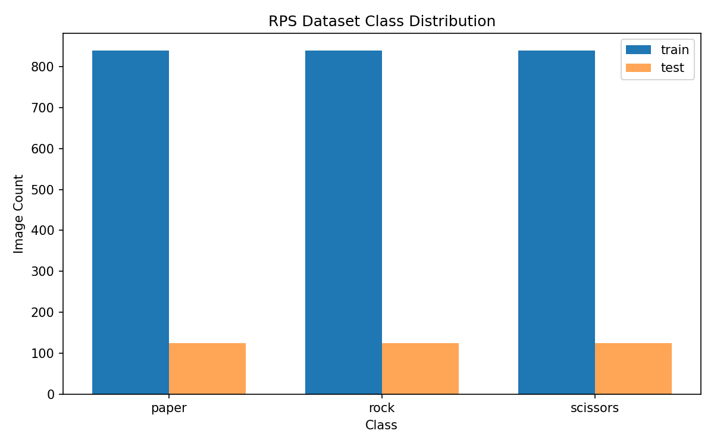

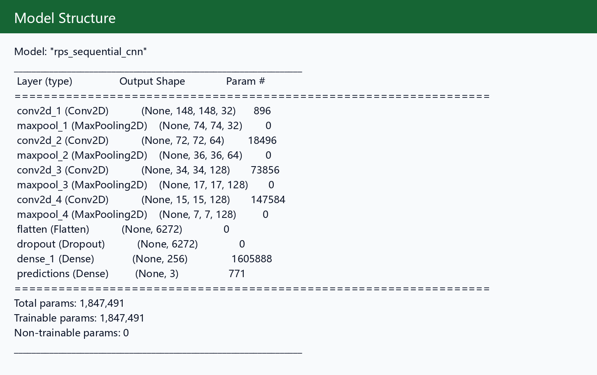

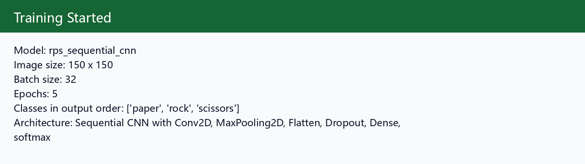

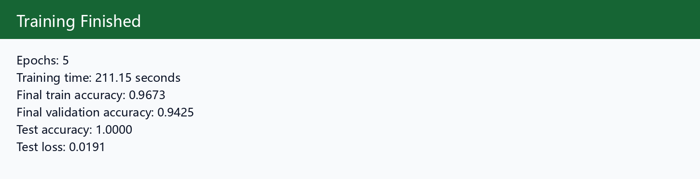

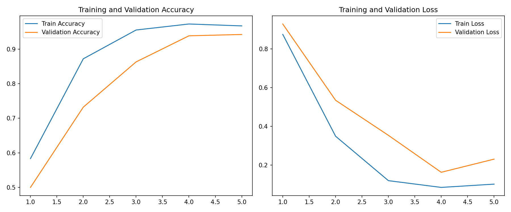

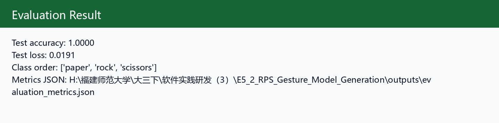

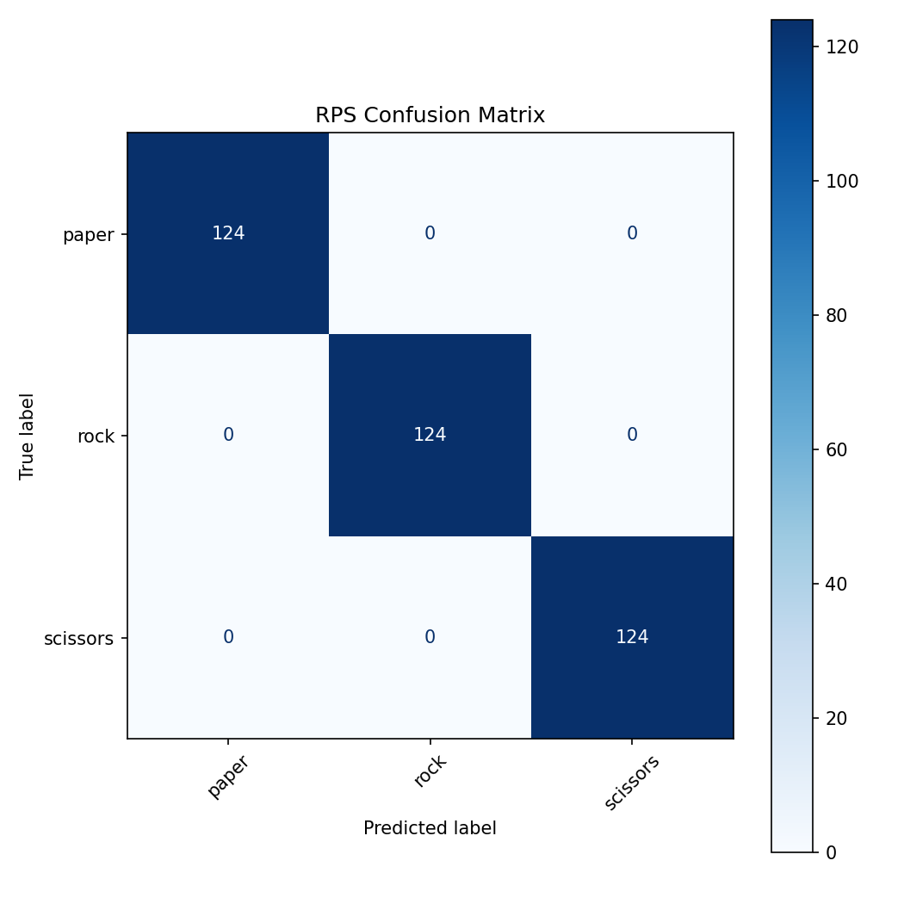

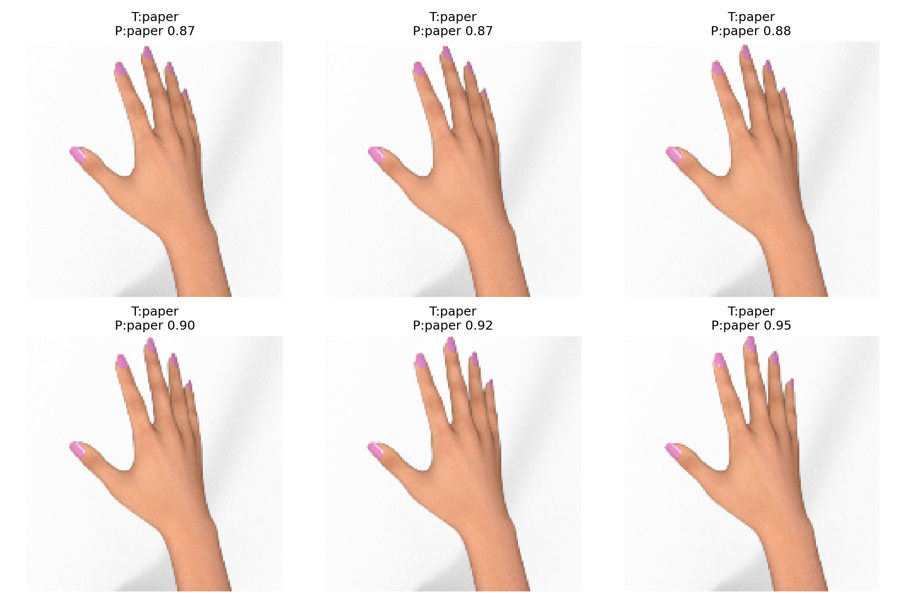

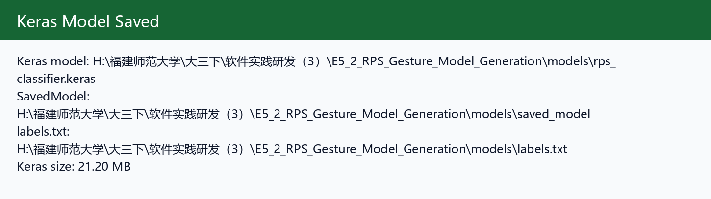

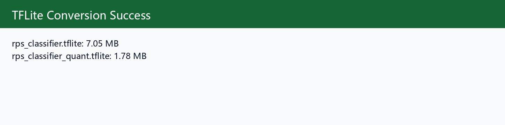

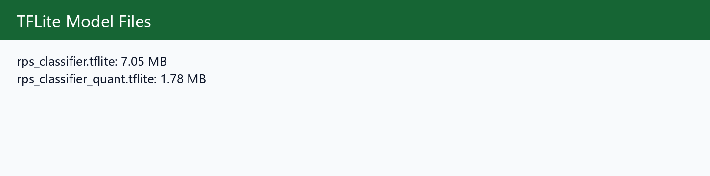

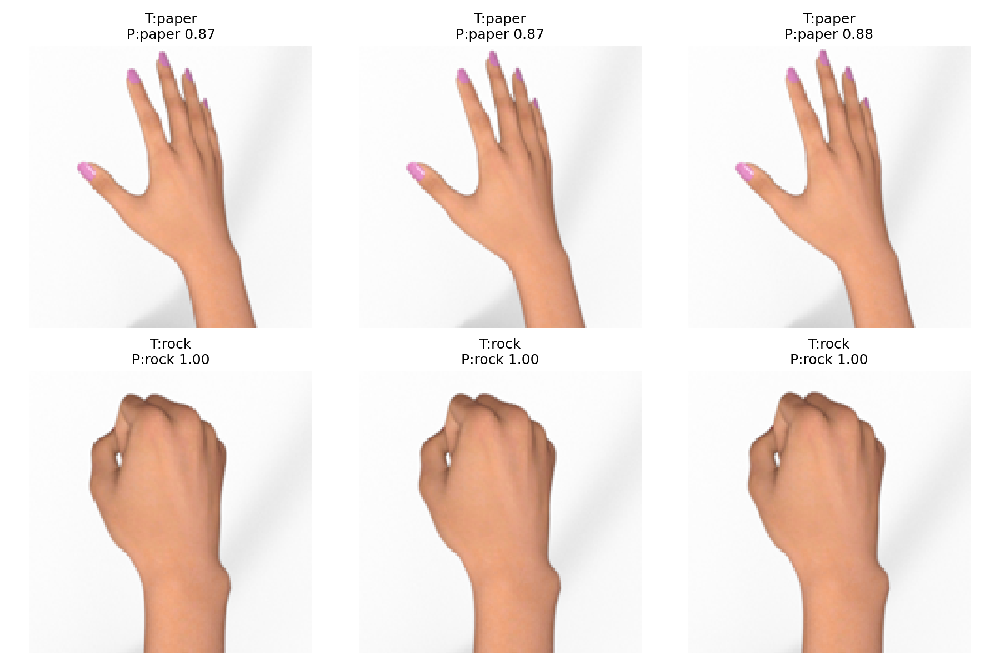

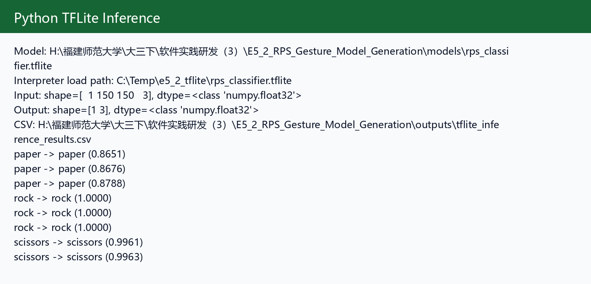


以下截图当前未生成，README 未引用为图片：

- `github_notebook_render.png`

- `github_commit_history.png`

## 十六、遇到的问题与解决方法

| 问题 | 原因 | 解决 |
|---|---|---|
| 默认 Python 3.14 无法安装 TensorFlow | TensorFlow Windows 原生版本不支持 Python 3.14 | 使用已有 Python 3.10 虚拟环境 `C:/Temp/e5tf310` |
| TFLite Interpreter 打不开中文路径模型 | TensorFlow 2.10 Windows TFLite 对非 ASCII 路径兼容性不好 | 推理时临时复制 `.tflite` 到 `C:/Temp/e5_2_tflite` |
| 数据集文件较大 | rps 图片数据集包含大量图片 | `.gitignore` 忽略 zip 和解压目录，只提交数据来源说明 |
| 训练速度受 CPU 限制 | 本机未检测到 GPU | 使用 5 个 epoch 保证完整闭环，并在 README 中说明 |

## 十七、与后续 Android 手势识别 App 的关系

本实验输出的 `rps_classifier.tflite`、`rps_classifier_quant.tflite` 和 `labels.txt` 可以复制到 Android 工程 assets 或 ml 目录中。Android 端需要按 150 x 150 输入尺寸处理图片，并保持 `labels.txt` 顺序与模型输出顺序一致。

## 十八、实验总结

本实验完成了从数据下载、预处理、Sequential CNN 训练、测试集评估、图形化验证、Keras / SavedModel 保存，到 TFLite 转换和 Python 端推理验证的完整流程。模型在测试集上取得了 1.0000 的准确率，能够完成石头剪刀布三类手势识别的基础任务。

## 十九、参考资料

- TensorFlow / Keras 官方文档
- TensorFlow Lite / LiteRT 官方文档
- Rock Paper Scissors dataset: `https://storage.googleapis.com/learning-datasets/rps.zip`
- Rock Paper Scissors test dataset: `https://storage.googleapis.com/learning-datasets/rps-test-set.zip`
